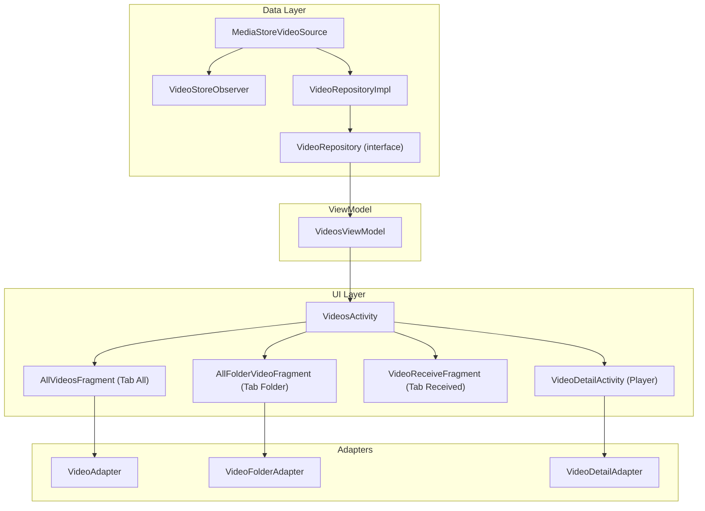

# Implementation Plan: Chức năng Quản lý Video

## Mô tả

Xây dựng chức năng **quản lý video** tương tự chức năng **Photo** hiện có, bao gồm danh sách video theo 3 tab (All / Folder / Received), xem chi tiết video, chế độ chọn nhiều, và video player. Kiến trúc sẽ tuân theo pattern của Photo feature để đảm bảo tính nhất quán.

---

## Kiến trúc tổng quan (Mapping từ Photo → Video)



---

## Open Questions

> [!IMPORTANT]
> **1. Video Player**: Trong thiết kế UI có video player với seekbar, controls (play/pause/rewind/forward/next/previous), lock, rotate. Tôi muốn sử dụng:
> - **Phương án A**: ExoPlayer (Media3) - player đầy đủ chức năng, seekbar, controls

> **2. PiP (Picture-in-Picture)**: Thiết kế có mini video overlay khi quay lại danh sách. Tôi muốn implement tính năng này trong phase đầu .(để sau)

> [!IMPORTANT]
> **3. Tab Received path**: Video nhận được sẽ nằm ở đường dẫn nào? Hiện Photo dùng `ShareFile/Photos/Received/`. Video sẽ dùng `ShareFile/Videos/Received/` - có đúng không?. đúng

---

## Proposed Changes

### Component 1: Model Layer

#### [NEW] [VideoInfo.kt](file:///d:/mobile/ASD039/app/src/main/java/com/example/basekotlin/model/VideoInfo.kt)

Tương tự [PhotoInfo.kt](file:///d:/mobile/ASD039/app/src/main/java/com/example/basekotlin/model/PhotoInfo.kt), thêm trường `duration` cho video.

```kotlin
data class VideoInfo(
    val id: Long,
    val displayName: String,
    val filePath: String,
    val relativeFolderPath: String,
    val sizeBytes: Long,
    val dateAddedSeconds: Long,
    val dateModifiedSeconds: Long,
    val widthPx: Int,
    val heightPx: Int,
    val durationMs: Long,         // Thời lượng video (ms)
    val mimeType: String,
    val contentUri: Uri
)
```

#### [NEW] [VideoFolder.kt](file:///d:/mobile/ASD039/app/src/main/java/com/example/basekotlin/model/VideoFolder.kt)

Tương tự [PhotoFolder.kt](file:///d:/mobile/ASD039/app/src/main/java/com/example/basekotlin/model/PhotoFolder.kt).

```kotlin
data class VideoFolder(
    val folderPath: String,
    val folderName: String,
    val videoCount: Int,
    val coverVideoUri: Uri?
)
```

---

### Component 2: Data Layer

#### [NEW] [MediaStoreVideoSource.kt](file:///d:/mobile/ASD039/app/src/main/java/com/example/basekotlin/data/local/videostore/MediaStoreVideoSource.kt)

Tương tự [MediaStorePhotoSource.kt](file:///d:/mobile/ASD039/app/src/main/java/com/example/basekotlin/data/local/photostore/MediaStorePhotoSource.kt), sử dụng `MediaStore.Video.Media` thay vì `MediaStore.Images.Media`.

```kotlin
object MediaStoreVideoSource {
    private val projection = arrayOf(
        MediaStore.Video.Media._ID,
        MediaStore.Video.Media.DISPLAY_NAME,
        MediaStore.Video.Media.SIZE,
        MediaStore.Video.Media.DATA,
        MediaStore.Video.Media.RELATIVE_PATH,
        MediaStore.Video.Media.DATE_ADDED,
        MediaStore.Video.Media.DATE_MODIFIED,
        MediaStore.Video.Media.WIDTH,
        MediaStore.Video.Media.HEIGHT,
        MediaStore.Video.Media.DURATION,
        MediaStore.Video.Media.MIME_TYPE,
    )

    suspend fun queryAllVideos(context: Context): List<VideoInfo> {
        // Query từ MediaStore.Video.Media.EXTERNAL_CONTENT_URI
        // Mapping cursor → VideoInfo
    }
}
```

#### [NEW] [VideoStoreObserver.kt](file:///d:/mobile/ASD039/app/src/main/java/com/example/basekotlin/data/local/videostore/VideoStoreObserver.kt)

Tương tự [PhotoStoreObserver.kt](file:///d:/mobile/ASD039/app/src/main/java/com/example/basekotlin/data/local/photostore/PhotoStoreObserver.kt), observe `MediaStore.Video.Media.EXTERNAL_CONTENT_URI`.

#### [NEW] [VideoRepository.kt](file:///d:/mobile/ASD039/app/src/main/java/com/example/basekotlin/data/local/repository/videos/VideoRepository.kt)

```kotlin
interface VideoRepository {
    fun observeAllVideos(): Flow<List<VideoInfo>>
    fun observeFolders(): Flow<List<VideoFolder>>
    fun observeVideosByFolder(folderPath: String): Flow<List<VideoInfo>>
    fun observeReceivedVideos(): Flow<List<VideoInfo>>
    suspend fun refreshAllVideos()
}
```

#### [NEW] [VideoRepositoryImpl.kt](file:///d:/mobile/ASD039/app/src/main/java/com/example/basekotlin/data/local/repository/videos/VideoRepositoryImpl.kt)

Tương tự [PhotoRepositoryImpl.kt](file:///d:/mobile/ASD039/app/src/main/java/com/example/basekotlin/data/local/repository/photos/PhotoRepositoryImpl.kt), với `RECEIVED_RELATIVE_PATH = "ShareFile/Videos/Received/"`.

---

### Component 3: ViewModel

#### [NEW] [VideosViewModel.kt](file:///d:/mobile/ASD039/app/src/main/java/com/example/basekotlin/ui/files/videos/VideosViewModel.kt)

Tương tự [PhotosViewModel.kt](file:///d:/mobile/ASD039/app/src/main/java/com/example/basekotlin/ui/files/photos/PhotosViewModel.kt), thay `PhotoInfo` → `VideoInfo`, `PhotoFolder` → `VideoFolder`, `PhotoRepository` → `VideoRepository`.

Bao gồm:
- `allVideosUi` (Tab All)
- `foldersUi` (Tab Folder)
- `receivedVideosUi` (Tab Received)
- `videosInCurrentFolderUi` (Folder Detail)
- Selection mode (`isSelectionMode`, `selectedVideoPaths`, `toggleVideoSelection`, etc.)
- Search (`searchQuery`, `updateSearchQuery`)
- Folder selection (`enterFolderSelectionMode`, `toggleFolderSelection`, `isFolderFullySelected`)

---

### Component 4: UI - Activity

#### [NEW] [VideosActivity.kt](file:///d:/mobile/ASD039/app/src/main/java/com/example/basekotlin/ui/files/videos/VideosActivity.kt)

Tương tự [PhotosActivity.kt](file:///d:/mobile/ASD039/app/src/main/java/com/example/basekotlin/ui/files/photos/PhotosActivity.kt).

Chức năng:
- Toolbar với Search, Select
- 3 tab: All / Folder / Received (via ViewPager2 + TabLayout)
- Selection mode + Bottom Action Bar (Send/Share/Delete/More)
- Mở FolderDetail bằng Fragment thay thế ViewPager
- Share video (`video/*` mime type thay vì `image/*`)
- Delete video
- Rename video
- Show video info dialog
- Move to SafeBox (TODO)

**Khác biệt so với Photo**: Không có Convert PDF, thay bằng các action phù hợp video.

#### [NEW] [VideoDetailActivity.kt](file:///d:/mobile/ASD039/app/src/main/java/com/example/basekotlin/ui/files/videos/VideoDetailActivity.kt)

**Đây là Video Player Activity** - khác hoàn toàn với PhotoDetailActivity.

Chức năng:
- ExoPlayer (Media3) để phát video
- Controls: Play/Pause, Seekbar, Rewind/Forward
- Header: Tên video + Back + More menu
- More menu: Send, Share, Delete, Rename, Information
- Swipe left/right để chuyển video (ViewPager2)

#### [NEW] [VideosPagerAdapter.kt](file:///d:/mobile/ASD039/app/src/main/java/com/example/basekotlin/ui/files/videos/VideosPagerAdapter.kt)

Tương tự [PhotosPagerAdapter.kt](file:///d:/mobile/ASD039/app/src/main/java/com/example/basekotlin/ui/files/photos/PhotosPagerAdapter.kt), trả về `AllVideosFragment`, `AllFolderVideoFragment`, `VideoReceiveFragment`.

---

### Component 5: UI - Fragment

#### [NEW] [AllVideosFragment.kt](file:///d:/mobile/ASD039/app/src/main/java/com/example/basekotlin/ui/files/videos/fragment/AllVideosFragment.kt)

Tương tự [AllPhotosFragment.kt](file:///d:/mobile/ASD039/app/src/main/java/com/example/basekotlin/ui/files/photos/fragment/AllPhotosFragment.kt).

- Grid 3 cột với header ngày tháng
- Group video theo ngày (groupVideosByDate)
- Selection mode support
- SwipeRefresh
- Empty state
- TYPE_ALL / TYPE_FOLDER (khi xem video trong folder)

#### [NEW] [AllFolderVideoFragment.kt](file:///d:/mobile/ASD039/app/src/main/java/com/example/basekotlin/ui/files/videos/fragment/AllFolderVideoFragment.kt)

Tương tự [AllFolderPhotoFragment.kt](file:///d:/mobile/ASD039/app/src/main/java/com/example/basekotlin/ui/files/photos/fragment/AllFolderPhotoFragment.kt).

- Grid 2 cột hiển thị folder
- Click mở folder detail
- Long click → selection mode
- Empty state

#### [NEW] [VideoReceiveFragment.kt](file:///d:/mobile/ASD039/app/src/main/java/com/example/basekotlin/ui/files/videos/fragment/VideoReceiveFragment.kt)

Tương tự [PhotoReceiveFragment.kt](file:///d:/mobile/ASD039/app/src/main/java/com/example/basekotlin/ui/files/photos/fragment/PhotoReceiveFragment.kt).

---

### Component 6: Adapter

#### [NEW] [VideoAdapter.kt](file:///d:/mobile/ASD039/app/src/main/java/com/example/basekotlin/ui/files/videos/adapter/VideoAdapter.kt)

Tương tự [PhotoAdapter.kt](file:///d:/mobile/ASD039/app/src/main/java/com/example/basekotlin/ui/files/photos/adapter/PhotoAdapter.kt).

Khác biệt:
- Item video hiển thị thêm **duration** overlay trên thumbnail (VD: "1:30")
- Item video hiển thị **icon play** overlay nhỏ trên thumbnail
- Sealed class `VideoListItem` (Header + Video)

#### [NEW] [VideoFolderAdapter.kt](file:///d:/mobile/ASD039/app/src/main/java/com/example/basekotlin/ui/files/videos/adapter/VideoFolderAdapter.kt)

Tương tự [PhotoFolderAdapter.kt](file:///d:/mobile/ASD039/app/src/main/java/com/example/basekotlin/ui/files/photos/adapter/PhotoFolderAdapter.kt).

#### [NEW] [VideoDetailAdapter.kt](file:///d:/mobile/ASD039/app/src/main/java/com/example/basekotlin/ui/files/videos/adapter/VideoDetailAdapter.kt)

Adapter cho ViewPager2 trong VideoDetailActivity, hiển thị ExoPlayer cho mỗi video.

---

### Component 7: Dialog

#### [NEW] [InformationVideoDialog.kt](file:///d:/mobile/ASD039/app/src/main/java/com/example/basekotlin/dialog/common/InformationVideoDialog.kt)

Tương tự [InformationPhotoDialog.kt](file:///d:/mobile/ASD039/app/src/main/java/com/example/basekotlin/dialog/common/InformationPhotoDialog.kt).

Khác biệt: Hiển thị thêm trường **Duration** (thời lượng video), **Resolution** (WxH).

#### [NEW] [SelectVideoMore1Dialog.kt](file:///d:/mobile/ASD039/app/src/main/java/com/example/basekotlin/dialog/common/SelectVideoMore1Dialog.kt)

Popup More cho chế độ multi-select video. Bao gồm:
- Rename (chỉ khi chọn 1)
- Move to SafeBox
- Information (chỉ khi chọn 1)

**Không có** Convert PDF (không phù hợp video).

#### [NEW] [SelectVideoMore2Dialog.kt](file:///d:/mobile/ASD039/app/src/main/java/com/example/basekotlin/dialog/common/SelectVideoMore2Dialog.kt)

Popup More cho VideoDetailActivity (xem 1 video). Bao gồm:
- Send, Share, Delete, Rename, Move to SafeBox, Information

---

### Component 8: Layout XML

#### [NEW] `activity_videos.xml`
Clone từ [activity_photos.xml](file:///d:/mobile/ASD039/app/src/main/res/layout/activity_photos.xml). Cùng cấu trúc: Toolbar + ViewPager2 + FragmentContainer + SelectionActions.

#### [NEW] `activity_video_detail.xml`
Layout cho Video Player. Bao gồm:
- Toolbar (back + tên video + more)
- **PlayerView** (ExoPlayer) hoặc **SurfaceView/TextureView**
- Seekbar + controls (play/pause, rewind, forward)
- Bottom controls

#### [NEW] `fragment_all_videos.xml`
Clone từ [fragment_all_photos.xml](file:///d:/mobile/ASD039/app/src/main/res/layout/fragment_all_photos.xml). RecyclerView + SwipeRefresh + Empty state + ProgressBar.

#### [NEW] `fragment_all_folder_video.xml`
Clone từ [fragment_all_folder_photo.xml](file:///d:/mobile/ASD039/app/src/main/res/layout/fragment_all_folder_photo.xml). RecyclerView + SwipeRefresh + Empty state.

#### [NEW] `item_video.xml`
Clone từ [item_photo.xml](file:///d:/mobile/ASD039/app/src/main/res/layout/item_photo.xml), thêm:
- `tvDuration`: TextView overlay hiển thị thời lượng (góc dưới phải)
- `ivPlayIcon`: ImageView icon play nhỏ overlay trên thumbnail

#### [NEW] `item_video_folder.xml`
Clone từ [item_photo_folder.xml](file:///d:/mobile/ASD039/app/src/main/res/layout/item_photo_folder.xml).

#### [NEW] `item_video_detail.xml`
Layout cho mỗi trang video trong ViewPager2 Player. Chứa ExoPlayer PlayerView.

#### [NEW] `toolbar_video.xml`
Clone từ [toolbar_photo.xml](file:///d:/mobile/ASD039/app/src/main/res/layout/toolbar_photo.xml). Đổi tiêu đề thành "Videos".

#### [NEW] `popup_video_selection_more1.xml`
Clone từ `popup_selection_more1.xml`, bỏ mục "Convert to PDF".

#### [NEW] `popup_video_selection_more2.xml`
Clone từ `popup_selection_more2.xml`, bỏ mục "Convert to PDF".

---

### Component 9: Resources

#### [MODIFY] [strings.xml](file:///d:/mobile/ASD039/app/src/main/res/values/strings.xml)

Thêm các string mới:

```xml
<!-- Video Management -->
<string name="videos">Videos</string>
<string name="no_videos_found">No Video Available</string>
<string name="no_videos_available_desc">There is no video in this section. Please import some</string>
<string name="delete_video">Delete Video?</string>
<string name="delete_video_desc">Are you sure you want to delete "%1$s" from your device?</string>
<string name="delete_videos_desc">Do you want to delete %1$d selected videos from this device?</string>
<string name="delete_video_success">Video deleted successfully</string>
<string name="delete_video_failed">Failed to delete video</string>
<string name="rename_video_success">Video renamed successfully</string>
<string name="rename_video_failed">Failed to rename video</string>
<string name="video_duration">Duration</string>
<string name="video_resolution">Resolution</string>
```

#### [NEW] Drawable resources (nếu cần)
- `ic_empty_videos.xml` - Vector icon cho empty state video (tương tự `ic_empty_photos.xml`)
- `ic_play_overlay.xml` - Icon play overlay trên thumbnail video

---

### Component 10: Navigation & Manifest

#### [MODIFY] [AndroidManifest.xml](file:///d:/mobile/ASD039/app/src/main/AndroidManifest.xml)

Đăng ký 2 Activity mới:

```xml
<activity
    android:name=".ui.files.videos.VideosActivity"
    android:exported="false"
    android:windowSoftInputMode="adjustResize" />
<activity
    android:name=".ui.files.videos.VideoDetailActivity"
    android:exported="false"
    android:windowSoftInputMode="adjustResize" />
```

#### [MODIFY] [FilesActivity.kt](file:///d:/mobile/ASD039/app/src/main/java/com/example/basekotlin/ui/files/FilesActivity.kt)

Thêm click handler cho nút Video (hiện đang không có `id` trong layout):

```kotlin
binding.btnVideo.tap {
    startNextActivity(VideosActivity::class.java, null)
}
```

#### [MODIFY] [activity_files.xml](file:///d:/mobile/ASD039/app/src/main/res/layout/activity_files.xml)

Thêm `android:id="@+id/btnVideo"` cho LinearLayout "Videos" trong GridLayout (hiện chưa có id).

---

## Tổng hợp danh sách file

| # | Loại | File | Dựa trên |
|---|------|------|----------|
| 1 | NEW | `model/VideoInfo.kt` | `PhotoInfo.kt` |
| 2 | NEW | `model/VideoFolder.kt` | `PhotoFolder.kt` |
| 3 | NEW | `data/local/videostore/MediaStoreVideoSource.kt` | `MediaStorePhotoSource.kt` |
| 4 | NEW | `data/local/videostore/VideoStoreObserver.kt` | `PhotoStoreObserver.kt` |
| 5 | NEW | `data/local/repository/videos/VideoRepository.kt` | `PhotoRepository.kt` |
| 6 | NEW | `data/local/repository/videos/VideoRepositoryImpl.kt` | `PhotoRepositoryImpl.kt` |
| 7 | NEW | `ui/files/videos/VideosViewModel.kt` | `PhotosViewModel.kt` |
| 8 | NEW | `ui/files/videos/VideosActivity.kt` | `PhotosActivity.kt` |
| 9 | NEW | `ui/files/videos/VideoDetailActivity.kt` | `PhotoDetailActivity.kt` + ExoPlayer |
| 10 | NEW | `ui/files/videos/VideosPagerAdapter.kt` | `PhotosPagerAdapter.kt` |
| 11 | NEW | `ui/files/videos/fragment/AllVideosFragment.kt` | `AllPhotosFragment.kt` |
| 12 | NEW | `ui/files/videos/fragment/AllFolderVideoFragment.kt` | `AllFolderPhotoFragment.kt` |
| 13 | NEW | `ui/files/videos/fragment/VideoReceiveFragment.kt` | `PhotoReceiveFragment.kt` |
| 14 | NEW | `ui/files/videos/adapter/VideoAdapter.kt` | `PhotoAdapter.kt` |
| 15 | NEW | `ui/files/videos/adapter/VideoFolderAdapter.kt` | `PhotoFolderAdapter.kt` |
| 16 | NEW | `ui/files/videos/adapter/VideoDetailAdapter.kt` | `PhotoDetailAdapter.kt` |
| 17 | NEW | `dialog/common/InformationVideoDialog.kt` | `InformationPhotoDialog.kt` |
| 18 | NEW | `dialog/common/SelectVideoMore1Dialog.kt` | `SelectMore1Dialog.kt` |
| 19 | NEW | `dialog/common/SelectVideoMore2Dialog.kt` | `SelectMore2Dialog.kt` |
| 20 | NEW | `res/layout/activity_videos.xml` | `activity_photos.xml` |
| 21 | NEW | `res/layout/activity_video_detail.xml` | Mới (ExoPlayer) |
| 22 | NEW | `res/layout/fragment_all_videos.xml` | `fragment_all_photos.xml` |
| 23 | NEW | `res/layout/fragment_all_folder_video.xml` | `fragment_all_folder_photo.xml` |
| 24 | NEW | `res/layout/item_video.xml` | `item_photo.xml` + duration |
| 25 | NEW | `res/layout/item_video_folder.xml` | `item_photo_folder.xml` |
| 26 | NEW | `res/layout/item_video_detail.xml` | Mới (ExoPlayer) |
| 27 | NEW | `res/layout/toolbar_video.xml` | `toolbar_photo.xml` |
| 28 | NEW | `res/layout/popup_video_selection_more1.xml` | `popup_selection_more1.xml` |
| 29 | NEW | `res/layout/popup_video_selection_more2.xml` | `popup_selection_more2.xml` |
| 30 | NEW | `res/drawable/ic_empty_videos.xml` | `ic_empty_photos.xml` |
| 31 | NEW | `res/drawable/ic_play_overlay.xml` | Mới |
| 32 | MODIFY | `res/values/strings.xml` | Thêm video strings |
| 33 | MODIFY | `AndroidManifest.xml` | Đăng ký Activity |
| 34 | MODIFY | `FilesActivity.kt` | Thêm btnVideo click |
| 35 | MODIFY | `activity_files.xml` | Thêm id btnVideo |

---

## Verification Plan

### Build Check
- Chạy `./gradlew assembleDebug` để verify compile thành công

### Manual Verification
1. **Mở Files → Video**: Verify chuyển sang VideosActivity
2. **Tab All**: Verify hiển thị grid 3 cột, header ngày tháng, thumbnail + duration
3. **Tab Folder**: Verify hiển thị grid folder, click mở folder detail
4. **Tab Received**: Verify hiển thị video nhận được
5. **Empty State**: Verify hiển thị khi không có video
6. **Search**: Verify tìm kiếm video theo tên
7. **Multi-Select**: Long press → chọn nhiều → Send/Share/Delete/More
8. **Delete Dialog**: Verify xác nhận xóa
9. **Rename Dialog**: Verify đổi tên video
10. **Video Player**: Verify phát video, seekbar, controls
11. **More Menu**: Verify menu chức năng trong player
12. **Back Navigation**: Verify xử lý back ở các trạng thái

