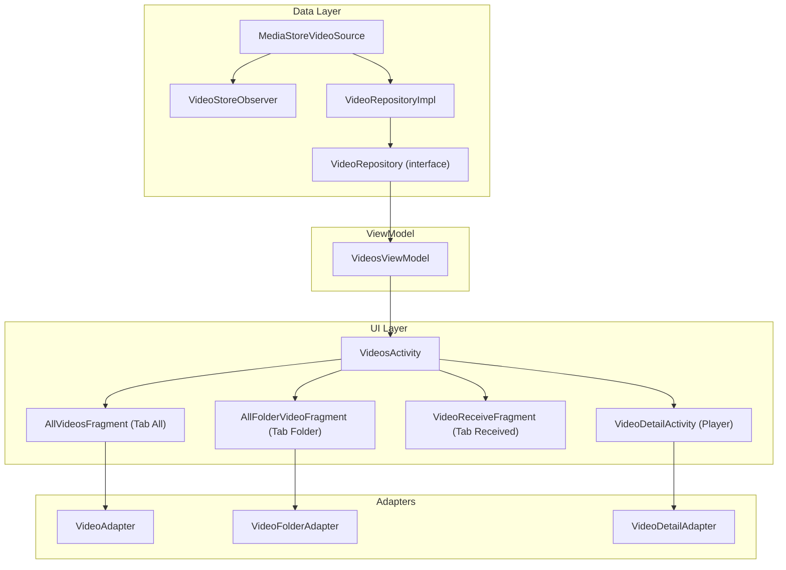

# Implementation Plan: Chức năng Quản lý Video

## Mô tả

Xây dựng chức năng **quản lý video** tương tự chức năng **Photo** hiện có, bao gồm danh sách video theo 3 tab (All / Folder / Received), xem chi tiết video, chế độ chọn nhiều, và video player. Kiến trúc sẽ tuân theo pattern của Photo feature để đảm bảo tính nhất quán.

---

## Kiến trúc tổng quan (Mapping từ Photo → Video)



---

## Open Questions

> [!IMPORTANT]
> **1. Video Player**: Trong thiết kế UI có video player với seekbar, controls (play/pause/rewind/forward/next/previous), lock, rotate. Tôi muốn sử dụng:
> - **Phương án A**: ExoPlayer (Media3) - player đầy đủ chức năng, seekbar, controls

> **2. PiP (Picture-in-Picture)**: Thiết kế có mini video overlay khi quay lại danh sách. Tôi muốn implement tính năng này trong phase đầu .(để sau)

> [!IMPORTANT]
> **3. Tab Received path**: Video nhận được sẽ nằm ở đường dẫn nào? Hiện Photo dùng `ShareFile/Photos/Received/`. Video sẽ dùng `ShareFile/Videos/Received/` - có đúng không?. đúng

---

## Proposed Changes

### Component 1: Model Layer

#### [NEW] [VideoInfo.kt](file:///d:/mobile/ASD039/app/src/main/java/com/example/basekotlin/model/VideoInfo.kt)

Tương tự [PhotoInfo.kt](file:///d:/mobile/ASD039/app/src/main/java/com/example/basekotlin/model/PhotoInfo.kt), thêm trường `duration` cho video.

```kotlin
data class VideoInfo(
    val id: Long,
    val displayName: String,
    val filePath: String,
    val relativeFolderPath: String,
    val sizeBytes: Long,
    val dateAddedSeconds: Long,
    val dateModifiedSeconds: Long,
    val widthPx: Int,
    val heightPx: Int,
    val durationMs: Long,         // Thời lượng video (ms)
    val mimeType: String,
    val contentUri: Uri
)
```

#### [NEW] [VideoFolder.kt](file:///d:/mobile/ASD039/app/src/main/java/com/example/basekotlin/model/VideoFolder.kt)

Tương tự [PhotoFolder.kt](file:///d:/mobile/ASD039/app/src/main/java/com/example/basekotlin/model/PhotoFolder.kt).

```kotlin
data class VideoFolder(
    val folderPath: String,
    val folderName: String,
    val videoCount: Int,
    val coverVideoUri: Uri?
)
```

---

### Component 2: Data Layer

#### [NEW] [MediaStoreVideoSource.kt](file:///d:/mobile/ASD039/app/src/main/java/com/example/basekotlin/data/local/videostore/MediaStoreVideoSource.kt)

Tương tự [MediaStorePhotoSource.kt](file:///d:/mobile/ASD039/app/src/main/java/com/example/basekotlin/data/local/photostore/MediaStorePhotoSource.kt), sử dụng `MediaStore.Video.Media` thay vì `MediaStore.Images.Media`.

```kotlin
object MediaStoreVideoSource {
    private val projection = arrayOf(
        MediaStore.Video.Media._ID,
        MediaStore.Video.Media.DISPLAY_NAME,
        MediaStore.Video.Media.SIZE,
        MediaStore.Video.Media.DATA,
        MediaStore.Video.Media.RELATIVE_PATH,
        MediaStore.Video.Media.DATE_ADDED,
        MediaStore.Video.Media.DATE_MODIFIED,
        MediaStore.Video.Media.WIDTH,
        MediaStore.Video.Media.HEIGHT,
        MediaStore.Video.Media.DURATION,
        MediaStore.Video.Media.MIME_TYPE,
    )

    suspend fun queryAllVideos(context: Context): List<VideoInfo> {
        // Query từ MediaStore.Video.Media.EXTERNAL_CONTENT_URI
        // Mapping cursor → VideoInfo
    }
}
```

#### [NEW] [VideoStoreObserver.kt](file:///d:/mobile/ASD039/app/src/main/java/com/example/basekotlin/data/local/videostore/VideoStoreObserver.kt)

Tương tự [PhotoStoreObserver.kt](file:///d:/mobile/ASD039/app/src/main/java/com/example/basekotlin/data/local/photostore/PhotoStoreObserver.kt), observe `MediaStore.Video.Media.EXTERNAL_CONTENT_URI`.

#### [NEW] [VideoRepository.kt](file:///d:/mobile/ASD039/app/src/main/java/com/example/basekotlin/data/local/repository/videos/VideoRepository.kt)

```kotlin
interface VideoRepository {
    fun observeAllVideos(): Flow<List<VideoInfo>>
    fun observeFolders(): Flow<List<VideoFolder>>
    fun observeVideosByFolder(folderPath: String): Flow<List<VideoInfo>>
    fun observeReceivedVideos(): Flow<List<VideoInfo>>
    suspend fun refreshAllVideos()
}
```

#### [NEW] [VideoRepositoryImpl.kt](file:///d:/mobile/ASD039/app/src/main/java/com/example/basekotlin/data/local/repository/videos/VideoRepositoryImpl.kt)

Tương tự [PhotoRepositoryImpl.kt](file:///d:/mobile/ASD039/app/src/main/java/com/example/basekotlin/data/local/repository/photos/PhotoRepositoryImpl.kt), với `RECEIVED_RELATIVE_PATH = "ShareFile/Videos/Received/"`.

---

### Component 3: ViewModel

#### [NEW] [VideosViewModel.kt](file:///d:/mobile/ASD039/app/src/main/java/com/example/basekotlin/ui/files/videos/VideosViewModel.kt)

Tương tự [PhotosViewModel.kt](file:///d:/mobile/ASD039/app/src/main/java/com/example/basekotlin/ui/files/photos/PhotosViewModel.kt), thay `PhotoInfo` → `VideoInfo`, `PhotoFolder` → `VideoFolder`, `PhotoRepository` → `VideoRepository`.

Bao gồm:
- `allVideosUi` (Tab All)
- `foldersUi` (Tab Folder)
- `receivedVideosUi` (Tab Received)
- `videosInCurrentFolderUi` (Folder Detail)
- Selection mode (`isSelectionMode`, `selectedVideoPaths`, `toggleVideoSelection`, etc.)
- Search (`searchQuery`, `updateSearchQuery`)
- Folder selection (`enterFolderSelectionMode`, `toggleFolderSelection`, `isFolderFullySelected`)

---

### Component 4: UI - Activity

#### [NEW] [VideosActivity.kt](file:///d:/mobile/ASD039/app/src/main/java/com/example/basekotlin/ui/files/videos/VideosActivity.kt)

Tương tự [PhotosActivity.kt](file:///d:/mobile/ASD039/app/src/main/java/com/example/basekotlin/ui/files/photos/PhotosActivity.kt).

Chức năng:
- Toolbar với Search, Select
- 3 tab: All / Folder / Received (via ViewPager2 + TabLayout)
- Selection mode + Bottom Action Bar (Send/Share/Delete/More)
- Mở FolderDetail bằng Fragment thay thế ViewPager
- Share video (`video/*` mime type thay vì `image/*`)
- Delete video
- Rename video
- Show video info dialog
- Move to SafeBox (TODO)

**Khác biệt so với Photo**: Không có Convert PDF, thay bằng các action To MP3(convert video sang Mp3), hiện lên 1 dialog để đặt tên file mp3.(mặc định là tên video + .mp3)

Dựa trên các ảnh thiết kế bạn gửi, có thể mô tả lại đầy đủ `VideoDetailActivity.kt` như sau:

---

Mình đã sắp xếp lại **đúng thứ tự chức năng và đánh lại số thứ tự** để tài liệu `VideoDetailActivity.kt` logic hơn, tránh bị nhảy từ `#4` → `#14` → `#11`.

# [NEW] `VideoDetailActivity.kt`

## Tổng quan

`VideoDetailActivity` là màn hình **Video Player** dùng để xem và quản lý video.

Màn hình này khác hoàn toàn với `PhotoDetailActivity` vì được thiết kế theo dạng **trình phát video toàn màn hình**, bao gồm các chức năng:

* Phát và tạm dừng video.
* Chuyển video trước/sau.
* Tua video.
* Điều chỉnh tốc độ phát.
* Điều chỉnh âm lượng.
* Thay đổi tỷ lệ hiển thị video.
* Chuyển đổi xoay màn hình.
* Quản lý Playing Queue.
* Picture-in-Picture (PiP).
* Khóa controls.
* Thao tác với file video.
* Swipe để chuyển giữa các video.

---

# 1. Video Playback

* Sử dụng **Media3 ExoPlayer** để phát video.
* Video được hiển thị gần như toàn màn hình.
* Giữ đúng tỷ lệ video và hỗ trợ thay đổi chế độ hiển thị.
* Có thể phát/dừng video bằng nút **Play/Pause**.
* Có thể Play/Pause video bằng cách chạm vào video.

### Trạng thái icon

Khi video đang phát:

```text
Pause
```

Sử dụng icon:

```text
ic_pause
```

Khi video đang tạm dừng:

```text
Play
```

Sử dụng icon:

```text
ic_play
```

Khi video phát kết thúc:

```text
Play
```

Sử dụng icon:

```text
ic_play
```

---

# 2. Header

Phía trên màn hình hiển thị Header gồm:

## 2.1. Back Button

* Quay lại màn hình trước.

## 2.2. Video Name

* Hiển thị tên file video hiện tại.

Ví dụ:

```text
VID_20200402_12194_A
```

## 2.3. Send Button

* Thực hiện thao tác gửi video.

## 2.4. More Menu

* Mở menu chứa các thao tác bổ sung với video.

### Hiển thị Header

Header sẽ:

* Hiển thị cùng với Player Controls.
* Tự động ẩn sau một khoảng thời gian không thao tác.

Điều này giúp tạo trải nghiệm xem video fullscreen.

---

# 3. Main Playback Controls

Ở chính giữa màn hình video có cụm điều khiển chính gồm 3 nút:

```text
⏮        ▶ / ❚❚        ⏭
Previous   Play/Pause    Next
```

## 3.1. Previous

```text
⏮
```

* Chuyển sang video trước đó.

## 3.2. Play / Pause

```text
▶ / ❚❚
```

* Phát video.
* Tạm dừng video.

## 3.3. Next

```text
⏭
```

* Chuyển sang video tiếp theo.

---

# 4. Bottom Playback Control Bar

Phía dưới video hiển thị thanh điều khiển playback.

Bao gồm:

1. Video Progress / SeekBar.
2. Playback Speed.
3. Volume Control.
4. Aspect Ratio.
5. Screen Orientation.
6. Play Queue.
7. Picture-in-Picture.
8. Lock Controls.

---

## 4.1. SeekBar / Video Progress

Hiển thị:

* Thời gian phát hiện tại.
* Tiến trình video.
* Tổng thời lượng video.

Ví dụ:

```text
00:54 ─────────────────────── 00:55
```

Người dùng có thể:

* Kéo SeekBar để tua đến vị trí bất kỳ.
* Theo dõi tiến trình phát video hiện tại.

---

## 4.2. Playback Speed

Cho phép người dùng thay đổi tốc độ phát video.

Các tốc độ hỗ trợ:

```text
0.5x
1.0x
1.5x
2.0x
```

Khi người dùng chọn tốc độ mới:

* Cập nhật playback speed của ExoPlayer.
* Video tiếp tục phát tại vị trí hiện tại.

---

## 4.3. Volume Control

Có nút điều khiển âm thanh:

### Volume On

```text
🔊
```

* Bật âm thanh video.

### Volume Off

```text
🔇
```

* Tắt âm thanh video.

---

## 4.4. Aspect Ratio

Cho phép thay đổi tỷ lệ hiển thị video.

Các chế độ hỗ trợ:

* **Fill**
* **1:1**
* **4:3**
* **16:9**

Ví dụ:

```text
Fill
```

Video được hiển thị phù hợp với màn hình.

```text
16:9
```

Hiển thị video với tỷ lệ 16:9.

```text
4:3
```

Hiển thị video với tỷ lệ 4:3.

```text
1:1
```

Hiển thị video với tỷ lệ vuông.

---

## 4.5. Screen Orientation

Cho phép chuyển đổi giữa:

* Portrait.
* Landscape.

Cả hai chế độ đều được sử dụng trong trải nghiệm xem video toàn màn hình.

---

## 4.6. Play Queue

Nhấn vào nút Play Queue để mở **Bottom Sheet Playing Queue**.

Bottom Sheet hiển thị danh sách các video đang nằm trong hàng đợi phát.

---

## 4.7. Picture-in-Picture Mode

Nhấn vào nút PiP để chuyển video sang chế độ:

```text
Picture-in-Picture
```

Video sẽ:

* Thu nhỏ thành một cửa sổ nhỏ.
* Hiển thị ở góc màn hình.
* Người dùng có thể tiếp tục xem video trong khi sử dụng ứng dụng khác.

---

## 4.8. Lock Controls

Có nút:

```text
🔒 Lock
```

Khi bật Lock:

* Khóa các thao tác điều khiển.
* Tránh người dùng vô tình chạm vào controls.
* Phù hợp khi xem video fullscreen.

Khi Unlock:

* Các controls hoạt động bình thường trở lại.

---

# 5. Playing Queue Bottom Sheet

Hiển thị khi người dùng nhấn nút **Play Queue**.

Header của Bottom Sheet:

```text
Playing Queue (12)
```

Hiển thị danh sách các video trong hàng đợi phát.

Mỗi item bao gồm:

* Thumbnail video.
* Video name.
* Duration.
* Nút thao tác/menu.
* Drag handle để thay đổi vị trí.

Ví dụ:

```text
[Thumbnail]  Redemption
             00:45

                         ☰
```

Người dùng có thể:

* Chọn video để phát.
* Xem video tiếp theo.
* Thay đổi thứ tự video bằng cách kéo item.
* Quản lý danh sách phát.

Khi thay đổi thứ tự:

* Playing Queue được cập nhật.
* Thứ tự Previous/Next cũng được cập nhật.

---

# 6. Swipe Left / Right để chuyển Video

Sử dụng **ViewPager2** để chuyển giữa các video.

Người dùng có thể:

```text
← Swipe        Video hiện tại        Swipe →
```

### Swipe Left / Right

* Swipe để chuyển sang video trước hoặc video tiếp theo.

Khi chuyển sang video mới:

* Cập nhật ExoPlayer.
* Cập nhật Video Name.
* Cập nhật Duration.
* Reset Playback Progress.
* Cập nhật trạng thái Play/Pause.
* Cập nhật Playing Queue.

---

# 7. Rewind / Forward Video

Hỗ trợ tua nhanh video bằng thao tác Double Tap.

```text
← 10s          Video hiện tại          10s →
```

## 7.1. Double Tap bên trái

* Tua lại 10 giây.

## 7.2. Double Tap bên phải

* Tua tới 10 giây.

---

# 8. Interaction với Player Controls

Khi người dùng chạm vào màn hình video:

Hiển thị:

* Header.
* Main Playback Controls.
* Bottom Playback Controls.

Sau một khoảng thời gian không có thao tác:

* Tự động ẩn Header.
* Tự động ẩn Main Controls.
* Tự động ẩn Bottom Controls.
* Chỉ hiển thị video.

Điều này tạo trải nghiệm fullscreen tương tự các ứng dụng Video Player.

---

# 9. UI States

`VideoDetailActivity` cần xử lý các trạng thái sau:

## 9.1. Loading

Khi ExoPlayer đang chuẩn bị video:

```text
Loading video...
```

Hiển thị Loading Indicator.

---

## 9.2. Playing

Khi video đang phát:

```text
▶ Video đang phát
```

* Icon Play/Pause hiển thị `Pause`.
* Progress liên tục được cập nhật.

---

## 9.3. Paused

Khi video đang tạm dừng:

```text
❚❚ Video đang tạm dừng
```

* Icon Play/Pause hiển thị `Play`.
* Progress dừng cập nhật theo playback.

---

## 9.4. Ended

Khi video phát hết:

* Hiển thị icon `Play`.
* Playback dừng ở cuối video.
* Người dùng có thể nhấn Play để phát lại.

---

# 10. More Menu

Khi người dùng nhấn nút **More** (`⋮`) trên Header, hiển thị Bottom Sheet.

Các chức năng chính gồm:

* Send.
* Share.
* Delete.
* More.

---

## 10.1. Send

```text
Send
```

Thực hiện thao tác gửi video sang ứng dụng hoặc dịch vụ khác.

---

## 10.2. Share

```text
Share
```

Chia sẻ video thông qua Android Share Sheet.

---

## 10.3. Delete

```text
Delete
```

Xóa video khỏi thiết bị.

Trước khi xóa cần hiển thị Dialog xác nhận.

### Delete Video Dialog

```text
Delete Video

Do you want to delete this video
from this device?

Cancel              Delete
```

### Cancel

* Hủy thao tác xóa.

### Delete

* Xác nhận xóa video.

Nút `Delete` cần sử dụng màu đỏ để cảnh báo thao tác nguy hiểm.

Sau khi xóa thành công:

* Xóa video khỏi danh sách.
* Cập nhật Playing Queue.
* Chuyển sang video tiếp theo hoặc quay lại màn hình trước nếu không còn video.

---

## 10.4. More Actions

Mở Dialog hoặc Bottom Sheet chứa các chức năng tương tự `VideoActivity`.

Bao gồm:

* Rename.
* Convert to MP3.
* Move to Safe Box.
* Information.

---

# 11. Video Lifecycle

Khi `VideoDetailActivity` được mở:

1. Nhận danh sách video.
2. Xác định video hiện tại.
3. Khởi tạo ExoPlayer.
4. Load video vào Player.
5. Chuẩn bị video.
6. Hiển thị Loading.
7. Video sẵn sàng để phát.

Khi Activity bị Pause hoặc Stop:

* Lưu trạng thái playback nếu cần.
* Pause video tùy theo lifecycle requirement.

Khi Activity bị Destroy:

* Release ExoPlayer.
* Hủy các Handler/Runnable.
* Hủy các callback liên quan đến Player.

---

# 12. Tổng kết chức năng

`VideoDetailActivity` bao gồm các nhóm chức năng chính:

### Video Playback

* Play/Pause.
* Previous/Next.
* Seek.
* Rewind 10s.
* Forward 10s.

### Video Display

* Aspect Ratio.
* Portrait/Landscape.
* Fullscreen experience.
* Picture-in-Picture.

### Player Controls

* Auto show/hide controls.
* Lock/Unlock controls.
* Volume On/Off.
* Playback Speed.

### Video Navigation

* ViewPager2.
* Swipe Left/Right.
* Previous/Next video.

### Queue Management

* Playing Queue.
* Chọn video.
* Sắp xếp video.
* Quản lý danh sách.

### File Actions

* Send.
* Share.
* Delete.
* Rename.
* Convert to MP3.
* Move to Safe Box.
* Information.


#### [NEW] [VideosPagerAdapter.kt](file:///d:/mobile/ASD039/app/src/main/java/com/example/basekotlin/ui/files/videos/VideosPagerAdapter.kt)

Tương tự [PhotosPagerAdapter.kt](file:///d:/mobile/ASD039/app/src/main/java/com/example/basekotlin/ui/files/photos/PhotosPagerAdapter.kt), trả về `AllVideosFragment`, `AllFolderVideoFragment`, `VideoReceiveFragment`.

---

### Component 5: UI - Fragment

#### [NEW] [AllVideosFragment.kt](file:///d:/mobile/ASD039/app/src/main/java/com/example/basekotlin/ui/files/videos/fragment/AllVideosFragment.kt)

Tương tự [AllPhotosFragment.kt](file:///d:/mobile/ASD039/app/src/main/java/com/example/basekotlin/ui/files/photos/fragment/AllPhotosFragment.kt).

- Grid 3 cột 
- Selection mode support
- SwipeRefresh
- Long click → selection mode
- Empty state

#### [NEW] [FolderDetailVideosFragment.kt](file:///d:/mobile/ASD039/app/src/main/java/com/example/basekotlin/ui/files/videos/fragment/FolderDetailVideosFragment.kt)

Tương tự [AllPhotosFragment.kt](file:///d:/mobile/ASD039/app/src/main/java/com/example/basekotlin/ui/files/photos/fragment/AllPhotosFragment.kt).

- Grid 3 cột 
- Selection mode support
- Long click → selection mode
- SwipeRefresh
- Empty state
dùng để hiển thị các video trong một folder, khi nhấn mở 1 folder, hiện ở fragmentContainer

#### [NEW] [AllFolderVideoFragment.kt](file:///d:/mobile/ASD039/app/src/main/java/com/example/basekotlin/ui/files/videos/fragment/AllFolderVideoFragment.kt)

Tương tự [AllFolderPhotoFragment.kt](file:///d:/mobile/ASD039/app/src/main/java/com/example/basekotlin/ui/files/photos/fragment/AllFolderPhotoFragment.kt).

- Grid 2 cột hiển thị folder
- Click mở folder detail
- Long click → selection mode
- Empty state
- SwipeRefresh

#### [NEW] [VideoReceiveFragment.kt](file:///d:/mobile/ASD039/app/src/main/java/com/example/basekotlin/ui/files/videos/fragment/VideoReceiveFragment.kt)

Tương tự [PhotoReceiveFragment.kt](file:///d:/mobile/ASD039/app/src/main/java/com/example/basekotlin/ui/files/photos/fragment/PhotoReceiveFragment.kt).

---

### Component 6: Adapter

#### [NEW] [VideoAdapter.kt](file:///d:/mobile/ASD039/app/src/main/java/com/example/basekotlin/ui/files/videos/adapter/VideoAdapter.kt)

Tương tự [PhotoAdapter.kt](file:///d:/mobile/ASD039/app/src/main/java/com/example/basekotlin/ui/files/photos/adapter/PhotoAdapter.kt).

Khác biệt:
- Item video hiển thị thêm **duration** overlay trên thumbnail (VD: "1:30")
- Item video hiển thị **icon play** overlay nhỏ trên thumbnail
- Sealed class `VideoListItem` (Header + Video)

#### [NEW] [VideoFolderAdapter.kt](file:///d:/mobile/ASD039/app/src/main/java/com/example/basekotlin/ui/files/videos/adapter/VideoFolderAdapter.kt)

Tương tự [PhotoFolderAdapter.kt](file:///d:/mobile/ASD039/app/src/main/java/com/example/basekotlin/ui/files/photos/adapter/PhotoFolderAdapter.kt).

#### [NEW] [VideoDetailAdapter.kt](file:///d:/mobile/ASD039/app/src/main/java/com/example/basekotlin/ui/files/videos/adapter/VideoDetailAdapter.kt)

Adapter cho ViewPager2 trong VideoDetailActivity, hiển thị ExoPlayer cho mỗi video.

---

### Component 7: Dialog

#### [NEW] [InformationVideoDialog.kt](file:///d:/mobile/ASD039/app/src/main/java/com/example/basekotlin/dialog/common/InformationVideoDialog.kt)

Tương tự [InformationPhotoDialog.kt](file:///d:/mobile/ASD039/app/src/main/java/com/example/basekotlin/dialog/common/InformationPhotoDialog.kt).

Khác biệt: Hiển thị thêm trường **Duration** (thời lượng video), **Resolution** (WxH).

#### [NEW] [SelectVideoMore1Dialog.kt](file:///d:/mobile/ASD039/app/src/main/java/com/example/basekotlin/dialog/common/SelectVideoMore1Dialog.kt)

Popup More cho chế độ multi-select video. Bao gồm:
- Rename (chỉ khi chọn 1)
- Move to SafeBox
- Information (chỉ khi chọn 1)

**Không có** Convert PDF (không phù hợp video).

#### [NEW] [SelectVideoMore2Dialog.kt](file:///d:/mobile/ASD039/app/src/main/java/com/example/basekotlin/dialog/common/SelectVideoMore2Dialog.kt)

Popup More cho VideoDetailActivity (xem 1 video). Bao gồm:
- Send, Share, Delete, Rename, Move to SafeBox, Information

---

### Component 8: Layout XML

#### [NEW] `activity_videos.xml`
Clone từ [activity_photos.xml](file:///d:/mobile/ASD039/app/src/main/res/layout/activity_photos.xml). Cùng cấu trúc: Toolbar + ViewPager2 + FragmentContainer + SelectionActions.

#### [NEW] `activity_video_detail.xml`
Layout cho Video Player. Bao gồm:
- Toolbar (back + tên video + more)
- **PlayerView** (ExoPlayer) hoặc **SurfaceView/TextureView**
- Seekbar + controls (play/pause, rewind, forward)
- Bottom controls

#### [NEW] `fragment_all_videos.xml`
Clone từ [fragment_all_photos.xml](file:///d:/mobile/ASD039/app/src/main/res/layout/fragment_all_photos.xml). RecyclerView + SwipeRefresh + Empty state + ProgressBar.

#### [NEW] `fragment_all_folder_video.xml`
Clone từ [fragment_all_folder_photo.xml](file:///d:/mobile/ASD039/app/src/main/res/layout/fragment_all_folder_photo.xml). RecyclerView + SwipeRefresh + Empty state.

#### [NEW] `item_video.xml`
Clone từ [item_photo.xml](file:///d:/mobile/ASD039/app/src/main/res/layout/item_photo.xml), thêm:
- `tvDuration`: TextView overlay hiển thị thời lượng (góc dưới phải)
- `ivPlayIcon`: ImageView icon play nhỏ overlay trên thumbnail

#### [NEW] `item_video_folder.xml`
Clone từ [item_photo_folder.xml](file:///d:/mobile/ASD039/app/src/main/res/layout/item_photo_folder.xml).

#### [NEW] `item_video_detail.xml`
Layout cho mỗi trang video trong ViewPager2 Player. Chứa ExoPlayer PlayerView.

#### [NEW] `toolbar_video.xml`
Clone từ [toolbar_photo.xml](file:///d:/mobile/ASD039/app/src/main/res/layout/toolbar_photo.xml). Đổi tiêu đề thành "Videos".

#### [NEW] `popup_video_selection_more1.xml`
Clone từ `popup_selection_more1.xml`, bỏ mục "Convert to PDF".

#### [NEW] `popup_video_selection_more2.xml`
Clone từ `popup_selection_more2.xml`, bỏ mục "Convert to PDF".

---

### Component 9: Resources

#### [MODIFY] [strings.xml](file:///d:/mobile/ASD039/app/src/main/res/values/strings.xml)

Thêm các string mới:

```xml
<!-- Video Management -->
<string name="videos">Videos</string>
<string name="no_videos_found">No Video Available</string>
<string name="no_videos_available_desc">There is no video in this section. Please import some</string>
<string name="delete_video">Delete Video?</string>
<string name="delete_video_desc">Are you sure you want to delete "%1$s" from your device?</string>
<string name="delete_videos_desc">Do you want to delete %1$d selected videos from this device?</string>
<string name="delete_video_success">Video deleted successfully</string>
<string name="delete_video_failed">Failed to delete video</string>
<string name="rename_video_success">Video renamed successfully</string>
<string name="rename_video_failed">Failed to rename video</string>
<string name="video_duration">Duration</string>
<string name="video_resolution">Resolution</string>
```

#### [NEW] Drawable resources (nếu cần)
- `ic_empty_videos.xml` - Vector icon cho empty state video (tương tự `ic_empty_photos.xml`)
- `ic_play_overlay.xml` - Icon play overlay trên thumbnail video

---

### Component 10: Navigation & Manifest

#### [MODIFY] [AndroidManifest.xml](file:///d:/mobile/ASD039/app/src/main/AndroidManifest.xml)

Đăng ký 2 Activity mới:

```xml
<activity
    android:name=".ui.files.videos.VideosActivity"
    android:exported="false"
    android:windowSoftInputMode="adjustResize" />
<activity
    android:name=".ui.files.videos.VideoDetailActivity"
    android:exported="false"
    android:windowSoftInputMode="adjustResize" />
```

#### [MODIFY] [FilesActivity.kt](file:///d:/mobile/ASD039/app/src/main/java/com/example/basekotlin/ui/files/FilesActivity.kt)

Thêm click handler cho nút Video (hiện đang không có `id` trong layout):

```kotlin
binding.btnVideo.tap {
    startNextActivity(VideosActivity::class.java, null)
}
```

#### [MODIFY] [activity_files.xml](file:///d:/mobile/ASD039/app/src/main/res/layout/activity_files.xml)

Thêm `android:id="@+id/btnVideo"` cho LinearLayout "Videos" trong GridLayout (hiện chưa có id).

---

## Tổng hợp danh sách file

| # | Loại | File | Dựa trên |
|---|------|------|----------|
| 1 | NEW | `model/VideoInfo.kt` | `PhotoInfo.kt` |
| 2 | NEW | `model/VideoFolder.kt` | `PhotoFolder.kt` |
| 3 | NEW | `data/local/videostore/MediaStoreVideoSource.kt` | `MediaStorePhotoSource.kt` |
| 4 | NEW | `data/local/videostore/VideoStoreObserver.kt` | `PhotoStoreObserver.kt` |
| 5 | NEW | `data/local/repository/videos/VideoRepository.kt` | `PhotoRepository.kt` |
| 6 | NEW | `data/local/repository/videos/VideoRepositoryImpl.kt` | `PhotoRepositoryImpl.kt` |
| 7 | NEW | `ui/files/videos/VideosViewModel.kt` | `PhotosViewModel.kt` |
| 8 | NEW | `ui/files/videos/VideosActivity.kt` | `PhotosActivity.kt` |
| 9 | NEW | `ui/files/videos/VideoDetailActivity.kt` | `PhotoDetailActivity.kt` + ExoPlayer |
| 10 | NEW | `ui/files/videos/VideosPagerAdapter.kt` | `PhotosPagerAdapter.kt` |
| 11 | NEW | `ui/files/videos/fragment/AllVideosFragment.kt` | `AllPhotosFragment.kt` |
| 12 | NEW | `ui/files/videos/fragment/AllFolderVideoFragment.kt` | `AllFolderPhotoFragment.kt` |
| 13 | NEW | `ui/files/videos/fragment/VideoReceiveFragment.kt` | `PhotoReceiveFragment.kt` |
| 14 | NEW | `ui/files/videos/adapter/VideoAdapter.kt` | `PhotoAdapter.kt` |
| 15 | NEW | `ui/files/videos/adapter/VideoFolderAdapter.kt` | `PhotoFolderAdapter.kt` |
| 16 | NEW | `ui/files/videos/adapter/VideoDetailAdapter.kt` | `PhotoDetailAdapter.kt` |
| 17 | NEW | `dialog/common/InformationVideoDialog.kt` | `InformationPhotoDialog.kt` |
| 18 | NEW | `dialog/common/SelectVideoMore1Dialog.kt` | `SelectMore1Dialog.kt` |
| 19 | NEW | `dialog/common/SelectVideoMore2Dialog.kt` | `SelectMore2Dialog.kt` |
| 20 | NEW | `res/layout/activity_videos.xml` | `activity_photos.xml` |
| 21 | NEW | `res/layout/activity_video_detail.xml` | Mới (ExoPlayer) |
| 22 | NEW | `res/layout/fragment_all_videos.xml` | `fragment_all_photos.xml` |
| 23 | NEW | `res/layout/fragment_all_folder_video.xml` | `fragment_all_folder_photo.xml` |
| 24 | NEW | `res/layout/item_video.xml` | `item_photo.xml` + duration |
| 25 | NEW | `res/layout/item_video_folder.xml` | `item_photo_folder.xml` |
| 26 | NEW | `res/layout/item_video_detail.xml` | Mới (ExoPlayer) |
| 27 | NEW | `res/layout/toolbar_video.xml` | `toolbar_photo.xml` |
| 28 | NEW | `res/layout/popup_video_selection_more1.xml` | `popup_selection_more1.xml` |
| 29 | NEW | `res/layout/popup_video_selection_more2.xml` | `popup_selection_more2.xml` |
| 30 | NEW | `res/drawable/ic_empty_videos.xml` | `ic_empty_photos.xml` |
| 31 | NEW | `res/drawable/ic_play_overlay.xml` | Mới |
| 32 | MODIFY | `res/values/strings.xml` | Thêm video strings |
| 33 | MODIFY | `AndroidManifest.xml` | Đăng ký Activity |
| 34 | MODIFY | `FilesActivity.kt` | Thêm btnVideo click |
| 35 | MODIFY | `activity_files.xml` | Thêm id btnVideo |

---

## Verification Plan

### Build Check
- Chạy `./gradlew assembleDebug` để verify compile thành công

### Manual Verification
1. **Mở Files → Video**: Verify chuyển sang VideosActivity
2. **Tab All**: Verify hiển thị grid 3 cột, header ngày tháng, thumbnail + duration
3. **Tab Folder**: Verify hiển thị grid folder, click mở folder detail
4. **Tab Received**: Verify hiển thị video nhận được
5. **Empty State**: Verify hiển thị khi không có video
6. **Search**: Verify tìm kiếm video theo tên
7. **Multi-Select**: Long press → chọn nhiều → Send/Share/Delete/More
8. **Delete Dialog**: Verify xác nhận xóa
9. **Rename Dialog**: Verify đổi tên video
10. **Video Player**: Verify phát video, seekbar, controls
11. **More Menu**: Verify menu chức năng trong player
12. **Back Navigation**: Verify xử lý back ở các trạng thái

