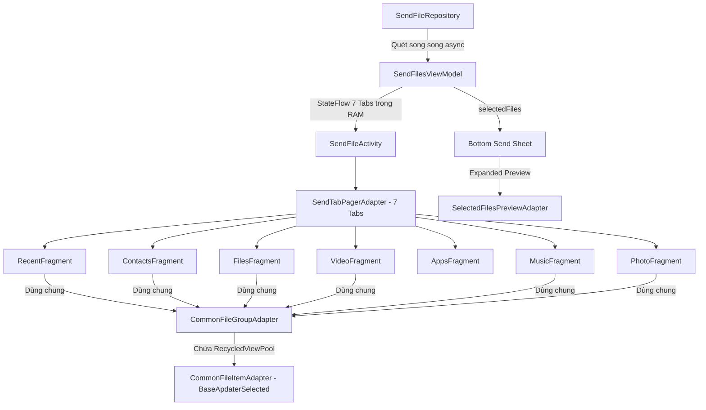

# Implementation Plan: Refactor Toàn Diện Hệ Thống Gửi File (Send Flow - 7 Tabs)

> **Mục tiêu**: Xây dựng lại toàn bộ module chọn file gửi (`SendFileActivity`) hỗ trợ 7 tabs (`Recent`, `Contacts`, `Files`, `Video`, `Apps`, `Music`, `Photo`) bằng kiến trúc hiện đại (Clean Architecture + UDF), sử dụng chung một Interface Model `TransferableItem`, Repository quét song song siêu tốc từ MediaStore, và Bottom Bar hiển thị 2 trạng thái (Thu gọn & Mở rộng xem chi tiết) như thiết kế.
> 
> **Cam kết**: Tuyệt đối **KHÔNG** implement code vào thư mục source code dự án khi chưa có lệnh xác nhận từ người dùng.

---

## I. Tổng Quan Kiến Trúc & Danh Sách Files



### Danh sách các file trong kế hoạch:

| STT | File | Loại | Mô tả |
|---|---|---|---|
| 1 | `TransferableItem.kt` | Model | Interface cốt lõi + BaseFileItem + ItemGroup |
| 2 | `SendFileRepository.kt` | Data | Quét song song MediaStore, Contacts, Apps |
| 3 | `SendFilesViewModel.kt` | ViewModel | Quản lý toàn bộ 7 tabs, Selection & Bottom Sheet |
| 4 | `CommonFileItemAdapter.kt` | Adapter | Kế thừa `BaseApdaterSelected`, dùng chung 6 tabs |
| 5 | `CommonFileGroupAdapter.kt` | Adapter | Adapter Card cha hiển thị Header và danh sách con |
| 6 | `SelectedFilesPreviewAdapter.kt` | Adapter | Adapter hiển thị Bottom Sheet mở rộng với nút `(-)` |
| 7 | `AppsAdapter.kt` | Adapter | Kế thừa `BaseApdaterSelected` cho tab Apps (Grid) |
| 8 | `item_file_group.xml` | Layout | Card trắng bo góc 16dp + Header nhóm |
| 9 | `item_transfer_file.xml` | Layout | Dòng file/contact con trong nhóm |
| 10 | `item_selected_file_preview.xml` | Layout | Dòng file trong Bottom Sheet mở rộng có nút `(-)` |
| 11 | `layout_bottom_send_sheet.xml` | Layout | Bottom bar 2 trạng thái (Thu gọn / Mở rộng) |
| 12 | `fragment_send_category.xml` | Layout | Layout dùng chung cho các tab (RecyclerView + Empty + Progress) |
| 13-19 | 7 Fragments | UI | `RecentFragment`, `ContactsFragment`, `FilesFragment`, `VideoFragment`, `AppsFragment`, `MusicFragment`, `PhotoFragment` |
| 20 | `SendTabPagerAdapter.kt` | Adapter | Khởi tạo đúng 7 tabs |
| 21 | `SendFileActivity.kt` | Activity | Điều khiển TabLayout, Chips Sub-tab, Bottom Sheet |

---

## II. Chi Tiết Code Từng File

### 1. Data Model & Interface: `TransferableItem.kt`
> Đường dẫn: `app/src/main/java/com/example/basekotlin/ui/transfer/model/TransferableItem.kt`

```kotlin
package com.example.basekotlin.ui.transfer.model

import android.net.Uri
import android.os.Parcelable
import kotlinx.parcelize.Parcelize

enum class FileCategory {
    RECENT_SENT, RECENT_RECEIVED, CONTACTS, FILES, VIDEO, APPS, MUSIC, PHOTO
}

enum class RecentSubTab { SEND, RECEIVED }
enum class VideoSubTab { RECENT, FOLDERS }
enum class PhotoSubTab { RECENT, FOLDERS }
enum class AppsSubTab { INSTALLED, NOT_INSTALLED }

/**
 * Interface duy nhất đại diện cho tất cả các đối tượng có thể chuyển gửi
 */
interface TransferableItem {
    val id: String               // Key duy nhất đối chiếu Set Selection O(1)
    val displayName: String      // Tên file / Contact name / App name
    val subInfo: String          // "23 MB - Oct 03, 2022" hoặc SĐT "0912 345 678"
    val sizeBytes: Long          // Dung lượng byte (Contact = 0)
    val dateModifiedMillis: Long // Thời gian tạo / sửa đổi
    val mimeType: String         // Mime type
    val uri: Uri                 // Content Uri truyền file
    val category: FileCategory   // Phân loại tab
    val thumbnailUri: Uri?       // Uri ảnh đại diện
    val fallbackLetter: String?  // Ký tự chữ cái (Contact/Music khi không có ảnh)
    val groupKey: String         // Khóa gom nhóm (Thư mục, Ngày tháng, Chữ cái, Loại file)
}

data class BaseFileItem(
    override val id: String,
    override val displayName: String,
    override val subInfo: String,
    override val sizeBytes: Long,
    override val dateModifiedMillis: Long,
    override val mimeType: String,
    override val uri: Uri,
    override val category: FileCategory,
    override val thumbnailUri: Uri? = null,
    override val fallbackLetter: String? = null,
    override val groupKey: String = ""
) : TransferableItem

data class ItemGroup<T : TransferableItem>(
    val title: String,          // Tiêu đề nhóm: "Jul 16, 2025" / "Camera" / "A" / "PDF"
    val count: Int,             // Số lượng item trong nhóm: 3
    val items: List<T>          // Danh sách các item
)
```

---

### 2. Repository Tập Trung: `SendFileRepository.kt`
> Đường dẫn: `app/src/main/java/com/example/basekotlin/ui/transfer/data/SendFileRepository.kt`

```kotlin
package com.example.basekotlin.ui.transfer.data

import android.content.ContentUris
import android.content.Context
import android.content.pm.ApplicationInfo
import android.net.Uri
import android.provider.ContactsContract
import android.provider.MediaStore
import android.text.format.Formatter
import com.example.basekotlin.ui.transfer.model.BaseFileItem
import com.example.basekotlin.ui.transfer.model.FileCategory
import com.example.basekotlin.ui.transfer.model.TransferableItem
import kotlinx.coroutines.Dispatchers
import kotlinx.coroutines.async
import kotlinx.coroutines.coroutineScope
import java.io.File
import java.text.SimpleDateFormat
import java.util.Date
import java.util.Locale

class SendFileRepository(private val context: Context) {

    private val dateFormat = SimpleDateFormat("MMM dd, yyyy", Locale.ENGLISH)

    data class InitialTransferData(
        val recentSent: List<TransferableItem>,
        val recentReceived: List<TransferableItem>,
        val contacts: List<TransferableItem>,
        val documents: List<TransferableItem>,
        val videos: List<TransferableItem>,
        val installedApps: List<TransferableItem>,
        val notInstalledApks: List<TransferableItem>,
        val music: List<TransferableItem>,
        val photos: List<TransferableItem>
    )

    /**
     * Nạp toàn bộ dữ liệu 7 Tabs song song bằng async (< 80ms)
     */
    suspend fun loadAllInitialData(): InitialTransferData = coroutineScope {
        val videosDeferred = async(Dispatchers.IO) { queryVideos() }
        val photosDeferred = async(Dispatchers.IO) { queryPhotos() }
        val docsDeferred = async(Dispatchers.IO) { queryDocuments() }
        val musicDeferred = async(Dispatchers.IO) { queryMusic() }
        val contactsDeferred = async(Dispatchers.IO) { queryContacts() }
        val installedAppsDeferred = async(Dispatchers.IO) { queryInstalledApps() }
        val notInstalledApksDeferred = async(Dispatchers.IO) { queryNotInstalledApks() }
        val recentSentDeferred = async(Dispatchers.IO) { queryRecentSent() }
        val recentReceivedDeferred = async(Dispatchers.IO) { queryRecentReceived() }

        InitialTransferData(
            recentSent = recentSentDeferred.await(),
            recentReceived = recentReceivedDeferred.await(),
            contacts = contactsDeferred.await(),
            documents = docsDeferred.await(),
            videos = videosDeferred.await(),
            installedApps = installedAppsDeferred.await(),
            notInstalledApks = notInstalledApksDeferred.await(),
            music = musicDeferred.await(),
            photos = photosDeferred.await()
        )
    }

    // 1. Quét Video (Lấy BUCKET_DISPLAY_NAME làm folder)
    fun queryVideos(): List<TransferableItem> {
        val list = mutableListOf<TransferableItem>()
        val projection = arrayOf(
            MediaStore.Video.Media._ID,
            MediaStore.Video.Media.DISPLAY_NAME,
            MediaStore.Video.Media.SIZE,
            MediaStore.Video.Media.MIME_TYPE,
            MediaStore.Video.Media.DATE_MODIFIED,
            MediaStore.Video.Media.BUCKET_DISPLAY_NAME
        )
        context.contentResolver.query(
            MediaStore.Video.Media.EXTERNAL_CONTENT_URI,
            projection, "${MediaStore.Video.Media.SIZE} > 0", null,
            "${MediaStore.Video.Media.DATE_MODIFIED} DESC"
        )?.use { c ->
            val idCol = c.getColumnIndexOrThrow(MediaStore.Video.Media._ID)
            val nameCol = c.getColumnIndexOrThrow(MediaStore.Video.Media.DISPLAY_NAME)
            val sizeCol = c.getColumnIndexOrThrow(MediaStore.Video.Media.SIZE)
            val mimeCol = c.getColumnIndexOrThrow(MediaStore.Video.Media.MIME_TYPE)
            val dateCol = c.getColumnIndexOrThrow(MediaStore.Video.Media.DATE_MODIFIED)
            val bucketCol = c.getColumnIndex(MediaStore.Video.Media.BUCKET_DISPLAY_NAME)

            while (c.moveToNext()) {
                val id = c.getLong(idCol)
                val uri = ContentUris.withAppendedId(MediaStore.Video.Media.EXTERNAL_CONTENT_URI, id)
                val size = c.getLong(sizeCol)
                val dateMod = c.getLong(dateCol) * 1000L
                val name = c.getString(nameCol) ?: "Video"
                val folder = if (bucketCol != -1) c.getString(bucketCol) ?: "Others" else "Others"

                list.add(BaseFileItem(
                    id = uri.toString(),
                    displayName = name,
                    subInfo = "${Formatter.formatShortFileSize(context, size)} - ${dateFormat.format(Date(dateMod))}",
                    sizeBytes = size,
                    dateModifiedMillis = dateMod,
                    mimeType = c.getString(mimeCol) ?: "video/*",
                    uri = uri,
                    category = FileCategory.VIDEO,
                    thumbnailUri = uri,
                    groupKey = folder
                ))
            }
        }
        return list
    }

    // 2. Quét Photo
    fun queryPhotos(): List<TransferableItem> {
        val list = mutableListOf<TransferableItem>()
        val projection = arrayOf(
            MediaStore.Images.Media._ID,
            MediaStore.Images.Media.DISPLAY_NAME,
            MediaStore.Images.Media.SIZE,
            MediaStore.Images.Media.MIME_TYPE,
            MediaStore.Images.Media.DATE_MODIFIED,
            MediaStore.Images.Media.BUCKET_DISPLAY_NAME
        )
        context.contentResolver.query(
            MediaStore.Images.Media.EXTERNAL_CONTENT_URI,
            projection, "${MediaStore.Images.Media.SIZE} > 0", null,
            "${MediaStore.Images.Media.DATE_MODIFIED} DESC"
        )?.use { c ->
            val idCol = c.getColumnIndexOrThrow(MediaStore.Images.Media._ID)
            val nameCol = c.getColumnIndexOrThrow(MediaStore.Images.Media.DISPLAY_NAME)
            val sizeCol = c.getColumnIndexOrThrow(MediaStore.Images.Media.SIZE)
            val mimeCol = c.getColumnIndexOrThrow(MediaStore.Images.Media.MIME_TYPE)
            val dateCol = c.getColumnIndexOrThrow(MediaStore.Images.Media.DATE_MODIFIED)
            val bucketCol = c.getColumnIndex(MediaStore.Images.Media.BUCKET_DISPLAY_NAME)

            while (c.moveToNext()) {
                val id = c.getLong(idCol)
                val uri = ContentUris.withAppendedId(MediaStore.Images.Media.EXTERNAL_CONTENT_URI, id)
                val size = c.getLong(sizeCol)
                val dateMod = c.getLong(dateCol) * 1000L
                val name = c.getString(nameCol) ?: "Photo"
                val folder = if (bucketCol != -1) c.getString(bucketCol) ?: "Others" else "Others"

                list.add(BaseFileItem(
                    id = uri.toString(),
                    displayName = name,
                    subInfo = "${Formatter.formatShortFileSize(context, size)} - ${dateFormat.format(Date(dateMod))}",
                    sizeBytes = size,
                    dateModifiedMillis = dateMod,
                    mimeType = c.getString(mimeCol) ?: "image/*",
                    uri = uri,
                    category = FileCategory.PHOTO,
                    thumbnailUri = uri,
                    groupKey = folder
                ))
            }
        }
        return list
    }

    // 3. Quét Contacts (Gom nhóm theo chữ cái A..Z)
    fun queryContacts(): List<TransferableItem> {
        val list = mutableListOf<TransferableItem>()
        val projection = arrayOf(
            ContactsContract.CommonDataKinds.Phone.CONTACT_ID,
            ContactsContract.CommonDataKinds.Phone.DISPLAY_NAME,
            ContactsContract.CommonDataKinds.Phone.NUMBER,
            ContactsContract.CommonDataKinds.Phone.PHOTO_URI
        )
        context.contentResolver.query(
            ContactsContract.CommonDataKinds.Phone.CONTENT_URI,
            projection, null, null,
            "${ContactsContract.CommonDataKinds.Phone.DISPLAY_NAME} COLLATE NOCASE ASC"
        )?.use { c ->
            val idCol = c.getColumnIndexOrThrow(ContactsContract.CommonDataKinds.Phone.CONTACT_ID)
            val nameCol = c.getColumnIndexOrThrow(ContactsContract.CommonDataKinds.Phone.DISPLAY_NAME)
            val numCol = c.getColumnIndexOrThrow(ContactsContract.CommonDataKinds.Phone.NUMBER)
            val photoCol = c.getColumnIndexOrThrow(ContactsContract.CommonDataKinds.Phone.PHOTO_URI)

            while (c.moveToNext()) {
                val id = c.getString(idCol)
                val name = c.getString(nameCol) ?: "Unknown"
                val phone = c.getString(numCol) ?: ""
                val photo = c.getString(photoCol)?.let { Uri.parse(it) }
                val firstChar = name.firstOrNull()?.uppercaseChar()?.toString()?.takeIf { it in "A".."Z" } ?: "#"

                list.add(BaseFileItem(
                    id = "contact_$id",
                    displayName = name,
                    subInfo = phone,
                    sizeBytes = 0L,
                    dateModifiedMillis = 0L,
                    mimeType = ContactsContract.CommonDataKinds.Phone.CONTENT_ITEM_TYPE,
                    uri = ContentUris.withAppendedId(ContactsContract.Contacts.CONTENT_URI, id.toLong()),
                    category = FileCategory.CONTACTS,
                    thumbnailUri = photo,
                    fallbackLetter = firstChar,
                    groupKey = firstChar
                ))
            }
        }
        return list
    }

    // 4. Quét Files Tài Liệu (PDF, EXCEL, PPT, TXT, DOC, WPS, ZIP)
    fun queryDocuments(): List<TransferableItem> {
        val list = mutableListOf<TransferableItem>()
        val projection = arrayOf(
            MediaStore.Files.FileColumns._ID,
            MediaStore.Files.FileColumns.DISPLAY_NAME,
            MediaStore.Files.FileColumns.SIZE,
            MediaStore.Files.FileColumns.DATA,
            MediaStore.Files.FileColumns.DATE_MODIFIED
        )
        val selection = "${MediaStore.Files.FileColumns.DATA} LIKE '%.pdf' OR " +
                "${MediaStore.Files.FileColumns.DATA} LIKE '%.doc' OR " +
                "${MediaStore.Files.FileColumns.DATA} LIKE '%.docx' OR " +
                "${MediaStore.Files.FileColumns.DATA} LIKE '%.xls' OR " +
                "${MediaStore.Files.FileColumns.DATA} LIKE '%.xlsx' OR " +
                "${MediaStore.Files.FileColumns.DATA} LIKE '%.ppt' OR " +
                "${MediaStore.Files.FileColumns.DATA} LIKE '%.pptx' OR " +
                "${MediaStore.Files.FileColumns.DATA} LIKE '%.txt' OR " +
                "${MediaStore.Files.FileColumns.DATA} LIKE '%.wps' OR " +
                "${MediaStore.Files.FileColumns.DATA} LIKE '%.zip'"

        context.contentResolver.query(
            MediaStore.Files.getContentUri("external"),
            projection, selection, null,
            "${MediaStore.Files.FileColumns.DATE_MODIFIED} DESC"
        )?.use { c ->
            val idCol = c.getColumnIndexOrThrow(MediaStore.Files.FileColumns._ID)
            val nameCol = c.getColumnIndexOrThrow(MediaStore.Files.FileColumns.DISPLAY_NAME)
            val sizeCol = c.getColumnIndexOrThrow(MediaStore.Files.FileColumns.SIZE)
            val dataCol = c.getColumnIndexOrThrow(MediaStore.Files.FileColumns.DATA)
            val dateCol = c.getColumnIndexOrThrow(MediaStore.Files.FileColumns.DATE_MODIFIED)

            while (c.moveToNext()) {
                val path = c.getString(dataCol) ?: continue
                val id = c.getLong(idCol)
                val uri = ContentUris.withAppendedId(MediaStore.Files.getContentUri("external"), id)
                val size = c.getLong(sizeCol)
                val dateMod = c.getLong(dateCol) * 1000L
                val name = c.getString(nameCol) ?: File(path).name
                val ext = File(path).extension.uppercase()
                val groupType = when (ext) {
                    "PDF" -> "PDF"
                    "XLS", "XLSX", "CSV" -> "EXCEL"
                    "PPT", "PPTX" -> "PPT"
                    "DOC", "DOCX" -> "DOC"
                    "TXT" -> "TXT"
                    "WPS" -> "WPS"
                    "ZIP", "RAR", "7Z" -> "ZIP"
                    else -> "OTHERS"
                }

                list.add(BaseFileItem(
                    id = uri.toString(),
                    displayName = name,
                    subInfo = "${Formatter.formatShortFileSize(context, size)} - ${dateFormat.format(Date(dateMod))}",
                    sizeBytes = size,
                    dateModifiedMillis = dateMod,
                    mimeType = "application/*",
                    uri = uri,
                    category = FileCategory.FILES,
                    thumbnailUri = null,
                    groupKey = groupType
                ))
            }
        }
        return list
    }

    // 5. Quét Music (Gom nhóm theo chữ cái bài hát A..Z)
    fun queryMusic(): List<TransferableItem> {
        val list = mutableListOf<TransferableItem>()
        val projection = arrayOf(
            MediaStore.Audio.Media._ID,
            MediaStore.Audio.Media.TITLE,
            MediaStore.Audio.Media.SIZE,
            MediaStore.Audio.Media.DATE_MODIFIED,
            MediaStore.Audio.Media.ALBUM_ID
        )
        context.contentResolver.query(
            MediaStore.Audio.Media.EXTERNAL_CONTENT_URI,
            projection, "${MediaStore.Audio.Media.IS_MUSIC} != 0 AND ${MediaStore.Audio.Media.SIZE} > 0", null,
            "${MediaStore.Audio.Media.TITLE} COLLATE NOCASE ASC"
        )?.use { c ->
            val idCol = c.getColumnIndexOrThrow(MediaStore.Audio.Media._ID)
            val titleCol = c.getColumnIndexOrThrow(MediaStore.Audio.Media.TITLE)
            val sizeCol = c.getColumnIndexOrThrow(MediaStore.Audio.Media.SIZE)
            val dateCol = c.getColumnIndexOrThrow(MediaStore.Audio.Media.DATE_MODIFIED)
            val albumIdCol = c.getColumnIndexOrThrow(MediaStore.Audio.Media.ALBUM_ID)

            while (c.moveToNext()) {
                val id = c.getLong(idCol)
                val uri = ContentUris.withAppendedId(MediaStore.Audio.Media.EXTERNAL_CONTENT_URI, id)
                val title = c.getString(titleCol) ?: "Music"
                val size = c.getLong(sizeCol)
                val dateMod = c.getLong(dateCol) * 1000L
                val firstChar = title.firstOrNull()?.uppercaseChar()?.toString()?.takeIf { it in "A".."Z" } ?: "#"

                list.add(BaseFileItem(
                    id = uri.toString(),
                    displayName = title,
                    subInfo = "${Formatter.formatShortFileSize(context, size)} - ${dateFormat.format(Date(dateMod))}",
                    sizeBytes = size,
                    dateModifiedMillis = dateMod,
                    mimeType = "audio/*",
                    uri = uri,
                    category = FileCategory.MUSIC,
                    thumbnailUri = ContentUris.withAppendedId(Uri.parse("content://media/external/audio/albumart"), c.getLong(albumIdCol)),
                    fallbackLetter = firstChar,
                    groupKey = firstChar
                ))
            }
        }
        return list
    }

    // 6. Quét Apps đã cài
    fun queryInstalledApps(): List<TransferableItem> {
        val pm = context.packageManager
        return pm.getInstalledApplications(0)
            .filter { it.flags and ApplicationInfo.FLAG_SYSTEM == 0 }
            .mapNotNull { appInfo ->
                val file = File(appInfo.sourceDir)
                if (!file.exists()) return@mapNotNull null
                val uri = Uri.fromFile(file)
                BaseFileItem(
                    id = appInfo.packageName,
                    displayName = pm.getApplicationLabel(appInfo).toString(),
                    subInfo = Formatter.formatShortFileSize(context, file.length()),
                    sizeBytes = file.length(),
                    dateModifiedMillis = file.lastModified(),
                    mimeType = "application/vnd.android.package-archive",
                    uri = uri,
                    category = FileCategory.APPS,
                    groupKey = "Installed"
                )
            }
            .sortedBy { it.displayName.lowercase() }
    }

    // 7. Quét File APK chưa cài
    fun queryNotInstalledApks(): List<TransferableItem> {
        val pm = context.packageManager
        val installedPackages = pm.getInstalledPackages(0).map { it.packageName }.toSet()
        val list = mutableListOf<TransferableItem>()
        val projection = arrayOf(MediaStore.Files.FileColumns.DATA, MediaStore.Files.FileColumns.SIZE)
        val selection = "${MediaStore.Files.FileColumns.DATA} LIKE '%.apk' AND ${MediaStore.Files.FileColumns.SIZE} > 0"

        context.contentResolver.query(
            MediaStore.Files.getContentUri("external"),
            projection, selection, null, null
        )?.use { c ->
            val dataCol = c.getColumnIndexOrThrow(MediaStore.Files.FileColumns.DATA)
            val sizeCol = c.getColumnIndexOrThrow(MediaStore.Files.FileColumns.SIZE)
            while (c.moveToNext()) {
                val apkPath = c.getString(dataCol) ?: continue
                val file = File(apkPath)
                if (!file.exists()) continue
                val pkgInfo = pm.getPackageArchiveInfo(apkPath, 0) ?: continue
                val pkgName = pkgInfo.packageName ?: continue
                if (!installedPackages.contains(pkgName)) {
                    val appName = pkgInfo.applicationInfo?.let {
                        it.sourceDir = apkPath
                        it.publicSourceDir = apkPath
                        pm.getApplicationLabel(it).toString()
                    } ?: file.nameWithoutExtension

                    list.add(BaseFileItem(
                        id = apkPath,
                        displayName = appName,
                        subInfo = Formatter.formatShortFileSize(context, c.getLong(sizeCol)),
                        sizeBytes = c.getLong(sizeCol),
                        dateModifiedMillis = file.lastModified(),
                        mimeType = "application/vnd.android.package-archive",
                        uri = Uri.fromFile(file),
                        category = FileCategory.APPS,
                        groupKey = "NotInstalled"
                    ))
                }
            }
        }
        return list.sortedBy { it.displayName.lowercase() }
    }

    // 8. Quét Lịch Sử Gửi / Nhận (Recent)
    fun queryRecentSent(): List<TransferableItem> {
        // Tương tự query từ database room/lịch sử chuyển file của app
        return emptyList()
    }

    fun queryRecentReceived(): List<TransferableItem> {
        return emptyList()
    }
}
```

---

### 3. ViewModel Quản Lý 7 Tabs & Selection: `SendFilesViewModel.kt`
> Đường dẫn: `app/src/main/java/com/example/basekotlin/ui/transfer/send/SendFilesViewModel.kt`

```kotlin
package com.example.basekotlin.ui.transfer.send

import android.app.Application
import android.text.format.Formatter
import androidx.lifecycle.AndroidViewModel
import androidx.lifecycle.viewModelScope
import com.example.basekotlin.ui.transfer.data.SendFileRepository
import com.example.basekotlin.ui.transfer.model.*
import kotlinx.coroutines.flow.*
import kotlinx.coroutines.launch
import java.text.SimpleDateFormat
import java.util.Date
import java.util.Locale

class SendFilesViewModel(application: Application) : AndroidViewModel(application) {

    private val repository = SendFileRepository(application)
    private val dateFormat = SimpleDateFormat("MMM dd, yyyy", Locale.ENGLISH)

    // ===== SUB-TAB CHO CÁC MÀN HÌNH =====
    val recentSubTab = MutableStateFlow(RecentSubTab.SEND)
    val videoSubTab = MutableStateFlow(VideoSubTab.RECENT)
    val photoSubTab = MutableStateFlow(PhotoSubTab.RECENT)
    val appsSubTab = MutableStateFlow(AppsSubTab.INSTALLED)

    // ===== QUẢN LÝ SELECTION (SINGLE SOURCE OF TRUTH) =====
    private val _selectedFiles = MutableStateFlow<List<TransferableItem>>(emptyList())
    val selectedFiles: StateFlow<List<TransferableItem>> = _selectedFiles.asStateFlow()

    // Trạng thái mở rộng Bottom Sheet
    val isBottomExpanded = MutableStateFlow(false)

    fun toggleFileSelection(item: TransferableItem) {
        val current = _selectedFiles.value.toMutableList()
        val index = current.indexOfFirst { it.id == item.id }
        if (index >= 0) current.removeAt(index) else current.add(item)
        _selectedFiles.value = current
    }

    fun removeSelectedFile(item: TransferableItem) {
        val current = _selectedFiles.value.toMutableList()
        current.removeAll { it.id == item.id }
        _selectedFiles.value = current
    }

    fun clearSelection() {
        _selectedFiles.value = emptyList()
        isBottomExpanded.value = false
    }

    // Text đếm dung lượng Bottom Bar: "2 of 5,5MB"
    val bottomSizeSummary: StateFlow<String> = _selectedFiles.map { list ->
        val totalBytes = list.sumOf { it.sizeBytes }
        val sizeFormatted = Formatter.formatShortFileSize(getApplication(), totalBytes)
        "${list.size} of $sizeFormatted"
    }.stateIn(viewModelScope, SharingStarted.WhileSubscribed(5000), "0 of 0 B")

    // ===== DỮ LIỆU GỐC TRONG RAM CHO 7 TABS =====
    private val _rawVideos = MutableStateFlow<List<TransferableItem>>(emptyList())
    private val _rawPhotos = MutableStateFlow<List<TransferableItem>>(emptyList())
    private val _rawDocs = MutableStateFlow<List<TransferableItem>>(emptyList())
    private val _rawMusic = MutableStateFlow<List<TransferableItem>>(emptyList())
    private val _rawContacts = MutableStateFlow<List<TransferableItem>>(emptyList())
    private val _rawInstalledApps = MutableStateFlow<List<TransferableItem>>(emptyList())
    private val _rawNotInstalledApps = MutableStateFlow<List<TransferableItem>>(emptyList())
    private val _rawRecentSent = MutableStateFlow<List<TransferableItem>>(emptyList())
    private val _rawRecentReceived = MutableStateFlow<List<TransferableItem>>(emptyList())

    val isLoading = MutableStateFlow(false)

    /**
     * Nạp toàn bộ dữ liệu 1 lần duy nhất khi mở SendFileActivity
     */
    fun loadInitialData() {
        if (_rawVideos.value.isNotEmpty()) return
        viewModelScope.launch {
            isLoading.value = true
            val data = repository.loadAllInitialData()
            _rawVideos.value = data.videos
            _rawPhotos.value = data.photos
            _rawDocs.value = data.documents
            _rawMusic.value = data.music
            _rawContacts.value = data.contacts
            _rawInstalledApps.value = data.installedApps
            _rawNotInstalledApps.value = data.notInstalledApks
            _rawRecentSent.value = data.recentSent
            _rawRecentReceived.value = data.recentReceived
            isLoading.value = false
        }
    }

    // ===== UDF STREAMS GOM NHÓM CHO TỪNG TAB =====

    // 1. Tab Video: Gom nhóm theo Ngày (Recent) hoặc theo Thư mục (Folders)
    val displayVideoGroups: StateFlow<List<ItemGroup<TransferableItem>>> = combine(
        videoSubTab, _rawVideos
    ) { subTab, videos ->
        when (subTab) {
            VideoSubTab.RECENT -> groupByDate(videos)
            VideoSubTab.FOLDERS -> groupByFolder(videos)
        }
    }.stateIn(viewModelScope, SharingStarted.WhileSubscribed(5000), emptyList())

    // 2. Tab Photo: Gom nhóm theo Ngày (Recent) hoặc theo Thư mục (Folders)
    val displayPhotoGroups: StateFlow<List<ItemGroup<TransferableItem>>> = combine(
        photoSubTab, _rawPhotos
    ) { subTab, photos ->
        when (subTab) {
            PhotoSubTab.RECENT -> groupByDate(photos)
            PhotoSubTab.FOLDERS -> groupByFolder(photos)
        }
    }.stateIn(viewModelScope, SharingStarted.WhileSubscribed(5000), emptyList())

    // 3. Tab Contacts: Gom nhóm theo bảng chữ cái (A..Z)
    val displayContactGroups: StateFlow<List<ItemGroup<TransferableItem>>> = _rawContacts.map { contacts ->
        contacts.groupBy { it.groupKey }
            .map { (char, list) -> ItemGroup(title = char, count = list.size, items = list) }
            .sortedBy { it.title }
    }.stateIn(viewModelScope, SharingStarted.WhileSubscribed(5000), emptyList())

    // 4. Tab Files (Documents): Gom nhóm theo loại (PDF, EXCEL, PPT, DOC, WPS, ZIP)
    val displayDocumentGroups: StateFlow<List<ItemGroup<TransferableItem>>> = _rawDocs.map { docs ->
        docs.groupBy { it.groupKey }
            .map { (type, list) -> ItemGroup(title = type, count = list.size, items = list) }
    }.stateIn(viewModelScope, SharingStarted.WhileSubscribed(5000), emptyList())

    // 5. Tab Music: Gom nhóm theo chữ cái bài hát (A..Z)
    val displayMusicGroups: StateFlow<List<ItemGroup<TransferableItem>>> = _rawMusic.map { songs ->
        songs.groupBy { it.groupKey }
            .map { (char, list) -> ItemGroup(title = char, count = list.size, items = list) }
            .sortedBy { it.title }
    }.stateIn(viewModelScope, SharingStarted.WhileSubscribed(5000), emptyList())

    // 6. Tab Recent: Gom nhóm theo Ngày (Send hoặc Received)
    val displayRecentGroups: StateFlow<List<ItemGroup<TransferableItem>>> = combine(
        recentSubTab, _rawRecentSent, _rawRecentReceived
    ) { subTab, sent, received ->
        val list = if (subTab == RecentSubTab.SEND) sent else received
        groupByDate(list)
    }.stateIn(viewModelScope, SharingStarted.WhileSubscribed(5000), emptyList())

    // 7. Tab Apps: Trả về danh sách AppItem dạng phẳng cho Grid Adapter
    val displayAppsList: StateFlow<List<TransferableItem>> = combine(
        appsSubTab, _rawInstalledApps, _rawNotInstalledApps
    ) { subTab, installed, notInstalled ->
        if (subTab == AppsSubTab.INSTALLED) installed else notInstalled
    }.stateIn(viewModelScope, SharingStarted.WhileSubscribed(5000), emptyList())

    // Tiện ích gom nhóm theo Ngày
    private fun groupByDate(items: List<TransferableItem>): List<ItemGroup<TransferableItem>> {
        return items.groupBy { dateFormat.format(Date(it.dateModifiedMillis)) }
            .map { (dateStr, list) -> ItemGroup(title = dateStr, count = list.size, items = list) }
    }

    // Tiện ích gom nhóm theo Folder
    private fun groupByFolder(items: List<TransferableItem>): List<ItemGroup<TransferableItem>> {
        return items.groupBy { it.groupKey }
            .map { (folder, list) -> ItemGroup(title = folder, count = list.size, items = list) }
            .sortedBy { it.title.lowercase() }
    }
}
```

---

### 4. Layouts XML

#### A. Card trắng bo góc 16dp + Header nhóm (`item_file_group.xml`)
> Đường dẫn: `app/src/main/res/layout/item_file_group.xml`

```xml
<?xml version="1.0" encoding="utf-8"?>
<LinearLayout xmlns:android="http://schemas.android.com/apk/res/android"
    xmlns:app="http://schemas.android.com/apk/res-auto"
    xmlns:tools="http://schemas.android.com/tools"
    android:layout_width="match_parent"
    android:layout_height="wrap_content"
    android:orientation="vertical"
    android:paddingHorizontal="16dp"
    android:paddingTop="12dp"
    android:paddingBottom="6dp">

    <!-- Header: "Jul 16, 2025 (3)" hoặc "Camera (12)" hoặc "A (5)" -->
    <LinearLayout
        android:layout_width="wrap_content"
        android:layout_height="wrap_content"
        android:layout_marginBottom="8dp"
        android:orientation="horizontal">

        <TextView
            android:id="@+id/tvGroupTitle"
            android:layout_width="wrap_content"
            android:layout_height="wrap_content"
            android:fontFamily="@font/outfit_bold"
            android:textColor="@color/black"
            android:textSize="18sp"
            tools:text="Jul 16, 2025" />

        <TextView
            android:id="@+id/tvGroupCount"
            android:layout_width="wrap_content"
            android:layout_height="wrap_content"
            android:layout_marginStart="4dp"
            android:fontFamily="@font/outfit_bold"
            android:textColor="@color/primary_35"
            android:textSize="18sp"
            tools:text="(3)" />
    </LinearLayout>

    <!-- Card trắng bo góc 16dp chứa các item con -->
    <androidx.cardview.widget.CardView
        android:layout_width="match_parent"
        android:layout_height="wrap_content"
        app:cardBackgroundColor="@color/white"
        app:cardCornerRadius="16dp"
        app:cardElevation="0dp">

        <androidx.recyclerview.widget.RecyclerView
            android:id="@+id/rvGroupFiles"
            android:layout_width="match_parent"
            android:layout_height="wrap_content"
            android:nestedScrollingEnabled="false"
            android:paddingHorizontal="12dp"
            android:paddingVertical="4dp"
            app:layoutManager="androidx.recyclerview.widget.LinearLayoutManager" />
    </androidx.cardview.widget.CardView>

</LinearLayout>
```

#### B. Dòng file/contact con trong nhóm (`item_transfer_file.xml`)
> Đường dẫn: `app/src/main/res/layout/item_transfer_file.xml`

```xml
<?xml version="1.0" encoding="utf-8"?>
<androidx.constraintlayout.widget.ConstraintLayout xmlns:android="http://schemas.android.com/apk/res/android"
    xmlns:app="http://schemas.android.com/apk/res-auto"
    xmlns:tools="http://schemas.android.com/tools"
    android:layout_width="match_parent"
    android:layout_height="wrap_content"
    android:background="?attr/selectableItemBackground"
    android:paddingVertical="8dp">

    <!-- Thumbnail hoặc Avatar chữ cái (cho Contact khi không có ảnh) -->
    <FrameLayout
        android:id="@+id/layoutThumb"
        android:layout_width="52dp"
        android:layout_height="52dp"
        app:layout_constraintBottom_toTopOf="@id/divider"
        app:layout_constraintStart_toStartOf="parent"
        app:layout_constraintTop_toTopOf="parent">

        <com.makeramen.roundedimageview.RoundedImageView
            android:id="@+id/imgThumbnail"
            android:layout_width="match_parent"
            android:layout_height="match_parent"
            android:scaleType="centerCrop"
            app:riv_corner_radius="14dp" />

        <TextView
            android:id="@+id/tvLetterAvatar"
            android:layout_width="match_parent"
            android:layout_height="match_parent"
            android:background="@drawable/bg_circle_primary"
            android:gravity="center"
            android:textColor="@color/white"
            android:textSize="20sp"
            android:fontFamily="@font/outfit_bold"
            android:visibility="gone"
            tools:text="A" />
    </FrameLayout>

    <!-- Tiêu đề (Tên file, tên Contact) -->
    <TextView
        android:id="@+id/tvFileName"
        android:layout_width="0dp"
        android:layout_height="wrap_content"
        android:layout_marginStart="12dp"
        android:layout_marginEnd="8dp"
        android:ellipsize="end"
        android:fontFamily="@font/outfit_semibold"
        android:maxLines="1"
        android:textColor="@color/black"
        android:textSize="15sp"
        app:layout_constraintBottom_toTopOf="@id/tvFileInfo"
        app:layout_constraintEnd_toStartOf="@id/ivCheckBox"
        app:layout_constraintStart_toEndOf="@id/layoutThumb"
        app:layout_constraintTop_toTopOf="@id/layoutThumb"
        tools:text="VID_20222021_21239_OFFA32" />

    <!-- Thông tin phụ (Dung lượng - Ngày hoặc SĐT) -->
    <TextView
        android:id="@+id/tvFileInfo"
        android:layout_width="0dp"
        android:layout_height="wrap_content"
        android:layout_marginStart="12dp"
        android:layout_marginTop="2dp"
        android:layout_marginEnd="8dp"
        android:ellipsize="end"
        android:fontFamily="@font/outfit_medium"
        android:maxLines="1"
        android:textColor="#808080"
        android:textSize="12sp"
        app:layout_constraintBottom_toBottomOf="@id/layoutThumb"
        app:layout_constraintEnd_toStartOf="@id/ivCheckBox"
        app:layout_constraintStart_toEndOf="@id/layoutThumb"
        app:layout_constraintTop_toBottomOf="@id/tvFileName"
        tools:text="23 MB - Oct 03,2022" />

    <!-- Checkbox chọn file -->
    <ImageView
        android:id="@+id/ivCheckBox"
        android:layout_width="22dp"
        android:layout_height="22dp"
        android:src="@drawable/radio_button_checked"
        android:visibility="gone"
        app:layout_constraintBottom_toBottomOf="@id/layoutThumb"
        app:layout_constraintEnd_toEndOf="parent"
        app:layout_constraintTop_toTopOf="@id/layoutThumb" />

    <!-- Divider phân cách -->
    <View
        android:id="@+id/divider"
        android:layout_width="match_parent"
        android:layout_height="0.8dp"
        android:layout_marginTop="8dp"
        android:background="#14000000"
        app:layout_constraintBottom_toBottomOf="parent"
        app:layout_constraintTop_toBottomOf="@id/layoutThumb" />

</androidx.constraintlayout.widget.ConstraintLayout>
```

#### C. Dòng file trong Bottom Sheet mở rộng có nút dấu trừ `(-)` (`item_selected_file_preview.xml`)
> Đường dẫn: `app/src/main/res/layout/item_selected_file_preview.xml`

```xml
<?xml version="1.0" encoding="utf-8"?>
<androidx.constraintlayout.widget.ConstraintLayout xmlns:android="http://schemas.android.com/apk/res/android"
    xmlns:app="http://schemas.android.com/apk/res-auto"
    xmlns:tools="http://schemas.android.com/tools"
    android:layout_width="match_parent"
    android:layout_height="wrap_content"
    android:paddingVertical="8dp">

    <FrameLayout
        android:id="@+id/layoutThumb"
        android:layout_width="48dp"
        android:layout_height="48dp"
        app:layout_constraintBottom_toTopOf="@id/divider"
        app:layout_constraintStart_toStartOf="parent"
        app:layout_constraintTop_toTopOf="parent">

        <com.makeramen.roundedimageview.RoundedImageView
            android:id="@+id/imgThumbnail"
            android:layout_width="match_parent"
            android:layout_height="match_parent"
            android:scaleType="centerCrop"
            app:riv_corner_radius="12dp" />

        <TextView
            android:id="@+id/tvLetterAvatar"
            android:layout_width="match_parent"
            android:layout_height="match_parent"
            android:background="@drawable/bg_circle_primary"
            android:gravity="center"
            android:textColor="@color/white"
            android:textSize="18sp"
            android:fontFamily="@font/outfit_bold"
            android:visibility="gone"
            tools:text="A" />
    </FrameLayout>

    <TextView
        android:id="@+id/tvName"
        android:layout_width="0dp"
        android:layout_height="wrap_content"
        android:layout_marginStart="12dp"
        android:layout_marginEnd="12dp"
        android:ellipsize="end"
        android:fontFamily="@font/outfit_bold"
        android:maxLines="1"
        android:textColor="@color/black"
        android:textSize="15sp"
        app:layout_constraintBottom_toTopOf="@id/tvSubInfo"
        app:layout_constraintEnd_toStartOf="@id/btnRemove"
        app:layout_constraintStart_toEndOf="@id/layoutThumb"
        app:layout_constraintTop_toTopOf="@id/layoutThumb"
        tools:text="Meow Pic" />

    <TextView
        android:id="@+id/tvSubInfo"
        android:layout_width="0dp"
        android:layout_height="wrap_content"
        android:layout_marginStart="12dp"
        android:layout_marginEnd="12dp"
        android:ellipsize="end"
        android:fontFamily="@font/outfit_medium"
        android:maxLines="1"
        android:textColor="#808080"
        android:textSize="12sp"
        app:layout_constraintBottom_toBottomOf="@id/layoutThumb"
        app:layout_constraintEnd_toStartOf="@id/btnRemove"
        app:layout_constraintStart_toEndOf="@id/layoutThumb"
        app:layout_constraintTop_toBottomOf="@id/tvName"
        tools:text="5,5 MB - Jul 16, 2025" />

    <!-- Nút tròn đỏ dấu trừ (-) để gỡ bỏ file -->
    <ImageView
        android:id="@+id/btnRemove"
        android:layout_width="24dp"
        android:layout_height="24dp"
        android:src="@drawable/ic_remove_red_circle"
        app:layout_constraintBottom_toBottomOf="@id/layoutThumb"
        app:layout_constraintEnd_toEndOf="parent"
        app:layout_constraintTop_toTopOf="@id/layoutThumb" />

    <View
        android:id="@+id/divider"
        android:layout_width="match_parent"
        android:layout_height="0.8dp"
        android:layout_marginTop="8dp"
        android:background="#14000000"
        app:layout_constraintBottom_toBottomOf="parent"
        app:layout_constraintTop_toBottomOf="@id/layoutThumb" />

</androidx.constraintlayout.widget.ConstraintLayout>
```

#### D. Bottom Bar 2 Trạng Thái: Thu gọn & Mở rộng (`layout_bottom_send_sheet.xml`)
> Đường dẫn: `app/src/main/res/layout/layout_bottom_send_sheet.xml`

```xml
<?xml version="1.0" encoding="utf-8"?>
<LinearLayout xmlns:android="http://schemas.android.com/apk/res/android"
    xmlns:app="http://schemas.android.com/apk/res-auto"
    xmlns:tools="http://schemas.android.com/tools"
    android:id="@+id/layoutBottomSend"
    android:layout_width="match_parent"
    android:layout_height="wrap_content"
    android:background="@drawable/bg_bottom_sheet_radius_24"
    android:orientation="vertical"
    android:padding="16dp">

    <!-- Header bar: Nút toggle expand + Dung lượng + Nút Xóa tất cả (X) -->
    <androidx.constraintlayout.widget.ConstraintLayout
        android:layout_width="match_parent"
        android:layout_height="wrap_content">

        <ImageView
            android:id="@+id/btnToggleExpand"
            android:layout_width="36dp"
            android:layout_height="36dp"
            android:background="@drawable/bg_circle_translucent"
            android:padding="8dp"
            android:src="@drawable/ic_arrow_up"
            app:layout_constraintBottom_toBottomOf="parent"
            app:layout_constraintStart_toStartOf="parent"
            app:layout_constraintTop_toTopOf="parent" />

        <TextView
            android:id="@+id/tvSizeOfTotal"
            android:layout_width="wrap_content"
            android:layout_height="wrap_content"
            android:layout_marginStart="16dp"
            android:fontFamily="@font/outfit_bold"
            android:textColor="@color/black"
            android:textSize="17sp"
            app:layout_constraintBottom_toBottomOf="parent"
            app:layout_constraintStart_toEndOf="@id/btnToggleExpand"
            app:layout_constraintTop_toTopOf="parent"
            tools:text="2 of 5,5MB" />

        <ImageView
            android:id="@+id/btnClearAll"
            android:layout_width="32dp"
            android:layout_height="32dp"
            android:src="@drawable/ic_clear_red_circle"
            app:layout_constraintBottom_toBottomOf="parent"
            app:layout_constraintEnd_toEndOf="parent"
            app:layout_constraintTop_toTopOf="parent" />
    </androidx.constraintlayout.widget.ConstraintLayout>

    <!-- Danh sách xem chi tiết các file đã chọn (Chỉ hiện khi Expanded) -->
    <androidx.recyclerview.widget.RecyclerView
        android:id="@+id/rvSelectedFiles"
        android:layout_width="match_parent"
        android:layout_height="wrap_content"
        android:layout_marginTop="12dp"
        android:maxHeight="260dp"
        android:visibility="gone"
        app:layoutManager="androidx.recyclerview.widget.LinearLayoutManager"
        tools:itemCount="2"
        tools:listitem="@layout/item_selected_file_preview" />

    <!-- Text: "2 file(s) selected" -->
    <TextView
        android:id="@+id/tvSelectedCount"
        android:layout_width="wrap_content"
        android:layout_height="wrap_content"
        android:layout_marginTop="12dp"
        android:fontFamily="@font/outfit_semibold"
        android:textColor="@color/black"
        android:textSize="15sp"
        tools:text="2 file(s) selected" />

    <!-- Nút SEND to màu xanh -->
    <androidx.appcompat.widget.AppCompatButton
        android:id="@+id/btnSend"
        android:layout_width="match_parent"
        android:layout_height="52dp"
        android:layout_marginTop="12dp"
        android:background="@drawable/bg_btn_send"
        android:fontFamily="@font/outfit_bold"
        android:text="@string/send"
        android:textAllCaps="false"
        android:textColor="@color/white"
        android:textSize="16sp" />

</LinearLayout>
```

---

### 5. Adapters

#### A. `CommonFileItemAdapter.kt` (Kế thừa `BaseApdaterSelected`)
> Đường dẫn: `app/src/main/java/com/example/basekotlin/ui/transfer/send/adapter/CommonFileItemAdapter.kt`

```kotlin
package com.example.basekotlin.ui.transfer.send.adapter

import android.view.LayoutInflater
import android.view.ViewGroup
import com.bumptech.glide.Glide
import com.example.basekotlin.R
import com.example.basekotlin.base.BaseApdaterSelected
import com.example.basekotlin.base.gone
import com.example.basekotlin.base.tap
import com.example.basekotlin.base.visible
import com.example.basekotlin.databinding.ItemTransferFileBinding
import com.example.basekotlin.ui.transfer.model.FileCategory
import com.example.basekotlin.ui.transfer.model.TransferableItem
import java.io.File

class CommonFileItemAdapter : BaseApdaterSelected<TransferableItem, ItemTransferFileBinding>() {

    var onClick: ((TransferableItem) -> Unit)? = null

    override fun setBinding(inflater: LayoutInflater, parent: ViewGroup, viewType: Int): ItemTransferFileBinding {
        return ItemTransferFileBinding.inflate(inflater, parent, false)
    }

    override fun addListData(newList: MutableList<TransferableItem>) {
        listData.clear()
        listData.addAll(newList)
        notifyDataSetChanged()
    }

    override fun getItemKey(item: TransferableItem): Any = item.id

    override fun setData(binding: ItemTransferFileBinding, item: TransferableItem, layoutPosition: Int) {
        binding.tvFileName.text = item.displayName
        binding.tvFileInfo.text = item.subInfo

        // Hiển thị ảnh/icon theo loại
        if (item.category == FileCategory.CONTACTS) {
            if (item.thumbnailUri != null) {
                binding.imgThumbnail.visible()
                binding.tvLetterAvatar.gone()
                Glide.with(binding.root.context).load(item.thumbnailUri).into(binding.imgThumbnail)
            } else {
                binding.imgThumbnail.gone()
                binding.tvLetterAvatar.visible()
                binding.tvLetterAvatar.text = item.fallbackLetter ?: "A"
            }
        } else {
            binding.tvLetterAvatar.gone()
            binding.imgThumbnail.visible()
            when (item.category) {
                FileCategory.VIDEO -> {
                    Glide.with(binding.root.context)
                        .load(item.thumbnailUri)
                        .placeholder(R.drawable.ic_video)
                        .error(R.drawable.ic_video)
                        .into(binding.imgThumbnail)
                }
                FileCategory.PHOTO -> {
                    Glide.with(binding.root.context)
                        .load(item.thumbnailUri)
                        .placeholder(R.drawable.ic_photo)
                        .error(R.drawable.ic_photo)
                        .into(binding.imgThumbnail)
                }
                FileCategory.MUSIC -> {
                    Glide.with(binding.root.context)
                        .load(item.thumbnailUri)
                        .placeholder(R.drawable.ic_music)
                        .error(R.drawable.ic_music)
                        .into(binding.imgThumbnail)
                }
                else -> {
                    binding.imgThumbnail.setImageResource(getDocumentIconRes(item.displayName))
                }
            }
        }

        // Ẩn divider cho item cuối cùng trong nhóm
        if (layoutPosition == listData.size - 1) {
            binding.divider.gone()
        } else {
            binding.divider.visible()
        }
    }

    override fun setSelection(binding: ItemTransferFileBinding, item: TransferableItem, layoutPosition: Int) {
        val isSelected = selectedKeys.contains(item.id)
        if (isSelected) {
            binding.ivCheckBox.visible()
        } else {
            binding.ivCheckBox.gone()
        }
    }

    override fun onCLick(binding: ItemTransferFileBinding, item: TransferableItem, layoutPosition: Int) {
        super.onCLick(binding, item, layoutPosition)
        binding.root.tap {
            onClick?.invoke(item)
        }
    }

    private fun getDocumentIconRes(fileName: String): Int {
        val ext = File(fileName).extension.lowercase()
        return when (ext) {
            "pdf" -> R.drawable.ic_pdf
            "xls", "xlsx", "csv" -> R.drawable.ic_excel
            "doc", "docx" -> R.drawable.ic_doc
            "ppt", "pptx" -> R.drawable.ic_ppt
            "txt" -> R.drawable.ic_txt
            "zip", "rar", "7z" -> R.drawable.ic_zip
            else -> R.drawable.ic_file
        }
    }
}
```

#### B. `CommonFileGroupAdapter.kt` (Adapter Card cha)
> Đường dẫn: `app/src/main/java/com/example/basekotlin/ui/transfer/send/adapter/CommonFileGroupAdapter.kt`

```kotlin
package com.example.basekotlin.ui.transfer.send.adapter

import android.view.LayoutInflater
import android.view.ViewGroup
import androidx.recyclerview.widget.RecyclerView
import com.example.basekotlin.base.BaseAdapter
import com.example.basekotlin.databinding.ItemFileGroupBinding
import com.example.basekotlin.ui.transfer.model.ItemGroup
import com.example.basekotlin.ui.transfer.model.TransferableItem

class CommonFileGroupAdapter : BaseAdapter<ItemGroup<TransferableItem>, ItemFileGroupBinding>() {

    var onItemClick: ((TransferableItem) -> Unit)? = null
    var selectedKeys: Set<Any> = emptySet()
        set(value) {
            field = value
            notifyDataSetChanged()
        }

    private val sharedPool = RecyclerView.RecycledViewPool()

    override fun setBinding(inflater: LayoutInflater, parent: ViewGroup, viewType: Int): ItemFileGroupBinding {
        return ItemFileGroupBinding.inflate(inflater, parent, false)
    }

    override fun addListData(newList: MutableList<ItemGroup<TransferableItem>>) {
        listData.clear()
        listData.addAll(newList)
        notifyDataSetChanged()
    }

    override fun setData(binding: ItemFileGroupBinding, item: ItemGroup<TransferableItem>, layoutPosition: Int) {
        binding.tvGroupTitle.text = item.title
        binding.tvGroupCount.text = "(${item.count})"

        val childAdapter = CommonFileItemAdapter()
        childAdapter.selectedKeys = selectedKeys
        childAdapter.onClick = { fileItem ->
            onItemClick?.invoke(fileItem)
        }

        binding.rvGroupFiles.setRecycledViewPool(sharedPool)
        binding.rvGroupFiles.adapter = childAdapter
        childAdapter.addListData(item.items.toMutableList())
    }
}
```

#### C. `SelectedFilesPreviewAdapter.kt` (Adapter Bottom Sheet mở rộng)
> Đường dẫn: `app/src/main/java/com/example/basekotlin/ui/transfer/send/adapter/SelectedFilesPreviewAdapter.kt`

```kotlin
package com.example.basekotlin.ui.transfer.send.adapter

import android.view.LayoutInflater
import android.view.ViewGroup
import com.bumptech.glide.Glide
import com.example.basekotlin.R
import com.example.basekotlin.base.BaseAdapter
import com.example.basekotlin.base.gone
import com.example.basekotlin.base.tap
import com.example.basekotlin.base.visible
import com.example.basekotlin.databinding.ItemSelectedFilePreviewBinding
import com.example.basekotlin.ui.transfer.model.FileCategory
import com.example.basekotlin.ui.transfer.model.TransferableItem

class SelectedFilesPreviewAdapter : BaseAdapter<TransferableItem, ItemSelectedFilePreviewBinding>() {

    var onRemoveClick: ((TransferableItem) -> Unit)? = null

    override fun setBinding(inflater: LayoutInflater, parent: ViewGroup, viewType: Int): ItemSelectedFilePreviewBinding {
        return ItemSelectedFilePreviewBinding.inflate(inflater, parent, false)
    }

    override fun addListData(newList: MutableList<TransferableItem>) {
        listData.clear()
        listData.addAll(newList)
        notifyDataSetChanged()
    }

    override fun setData(binding: ItemSelectedFilePreviewBinding, item: TransferableItem, layoutPosition: Int) {
        binding.tvName.text = item.displayName
        binding.tvSubInfo.text = item.subInfo

        if (item.category == FileCategory.CONTACTS && item.thumbnailUri == null) {
            binding.imgThumbnail.gone()
            binding.tvLetterAvatar.visible()
            binding.tvLetterAvatar.text = item.fallbackLetter ?: "A"
        } else {
            binding.tvLetterAvatar.gone()
            binding.imgThumbnail.visible()
            Glide.with(binding.root.context)
                .load(item.thumbnailUri)
                .placeholder(R.drawable.ic_file)
                .error(R.drawable.ic_file)
                .into(binding.imgThumbnail)
        }

        binding.btnRemove.tap {
            onRemoveClick?.invoke(item)
        }
    }
}
```

---

## III. Kế Hoạch Triển Khai 7 Fragments

Mỗi Fragment (`RecentFragment`, `ContactsFragment`, `FilesFragment`, `VideoFragment`, `MusicFragment`, `PhotoFragment`) chỉ cần kế thừa `BaseFragment<FragmentSendCategoryBinding>` và lắng nghe đúng StateFlow tương ứng từ `SendFilesViewModel`:

```kotlin
class VideoFragment : BaseFragment<FragmentSendCategoryBinding>() {
    private val viewModel: SendFilesViewModel by activityViewModels()
    private val groupAdapter = CommonFileGroupAdapter()

    override fun initView() {
        binding.rvItems.adapter = groupAdapter
        groupAdapter.onItemClick = { item -> viewModel.toggleFileSelection(item) }
    }

    override fun bindView() {
        viewLifecycleOwner.lifecycleScope.launch {
            viewLifecycleOwner.repeatOnLifecycle(Lifecycle.State.STARTED) {
                launch {
                    viewModel.displayVideoGroups.collect { groups ->
                        groupAdapter.addListData(groups.toMutableList())
                        updateEmptyState(groups.isEmpty())
                    }
                }
                launch {
                    viewModel.selectedFiles.collect { files ->
                        groupAdapter.selectedKeys = files.map { it.id }.toSet()
                    }
                }
            }
        }
    }
}
```

---

## IV. Verification & Kiểm Thử

1. **Hiệu năng Quét**: Đo thời gian thực thi của `loadAllInitialData()` (Mục tiêu < 100ms trên máy thật).
2. **Chuyển Tab**: Kiểm tra chuyển qua lại giữa 7 tabs và 2 sub-tab (Mục tiêu 0ms delay, không tải lại dữ liệu).
3. **Hiệu năng Checkbox**: Kiểm tra tốc độ tick chọn file (Mục tiêu không rebind thumbnail, chỉ đổi checkbox).
4. **Bottom Bar**: Kiểm tra đồng bộ tính toán dung lượng `2 of 5,5MB`, bấm mở rộng xem danh sách và bấm `(-)` gỡ bỏ item.
